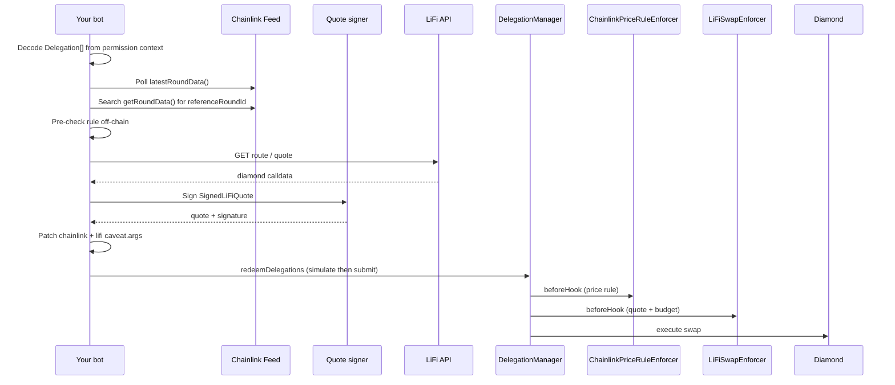

# ChainlinkPriceRuleEnforcer — App Integration Guide

This guide is for **dapps, price-monitoring bots, and session accounts** that redeem delegations granted by EIP-7715 wallets using the [`ChainlinkPriceRuleEnforcer`](src/enforcers/ChainlinkPriceRuleEnforcer.sol), typically stacked with [`LiFiSwapEnforcer`](src/enforcers/LiFiSwapEnforcer.sol) for buy-the-dip and take-profit swap products.

It covers monitoring Chainlink feeds, selecting reference rounds, encoding caveat args, and calling `redeemDelegations`.

## Prerequisites

You receive from the wallet (EIP-7715 response):

| Field | Content |
|---|---|
| `permissions.context` | `abi.encode(Delegation[])` — leaf to root |
| `permissions.delegationManager` | DelegationManager address |
| User `delegator` | DeleGator smart account |
| `delegate` | Your bot / session account (must match `Delegation.delegate`) |

Additionally:

- RPC access to read Chainlink feed proxies (`latestRoundData`, `getRoundData`).
- For swap products: LiFi route API, `quoteSigner` key, and user token approval to LiFi diamond (separate onboarding delegation or prior `approve` tx). See [LiFi app guide](LiFiSwapEnforcer-App-Integration.md).

## End-to-end flow



## Step 1 — Decode the permission context

```typescript
const delegations: Delegation[] = decodeAbi(["Delegation[]"], permissionContext)[0];
const swapDelegation = delegations[delegations.length - 1];

const chainlinkCaveat = swapDelegation.caveats.find(
  (c) => c.enforcer.toLowerCase() === CHAINLINK_PRICE_RULE_ENFORCER.toLowerCase()
);
if (!chainlinkCaveat) throw new Error("Missing ChainlinkPriceRuleEnforcer caveat");

const chainlinkTerms = decodeChainlinkTerms(chainlinkCaveat.terms);

const lifiCaveat = swapDelegation.caveats.find(
  (c) => c.enforcer.toLowerCase() === LIFI_SWAP_ENFORCER.toLowerCase()
);
// lifiCaveat required for swap products — see LiFi app guide
```

### Terms decoder (TypeScript reference)

```typescript
const TERMS_LENGTH = 68;

const RULE_KIND_DIP = 0;
const RULE_KIND_RISE = 1;
const RULE_KIND_ABSOLUTE_GTE = 2;
const RULE_KIND_ABSOLUTE_LTE = 3;

interface ChainlinkTerms {
  priceFeed: Address;
  ruleKind: number;
  expectedDecimals: number;
  windowSeconds: number;
  thresholdBps: number;
  maxStaleSeconds: number;
  minGapSeconds: number;
  triggerPrice: bigint;
}

function decodeChainlinkTerms(terms: Hex): ChainlinkTerms {
  const buf = hexToBytes(terms);
  if (buf.length !== TERMS_LENGTH) throw new Error("invalid terms length");

  const triggerPrice = bytesToSignedBigInt(buf.slice(36, 68));

  return {
    priceFeed: bytesToAddress(buf.slice(0, 20)),
    ruleKind: buf[20],
    expectedDecimals: buf[21],
    windowSeconds: readUint32BE(buf, 22),
    thresholdBps: readUint16BE(buf, 26),
    maxStaleSeconds: readUint32BE(buf, 28),
    minGapSeconds: readUint32BE(buf, 32),
    triggerPrice,
  };
}
```

Mirror [`ChainlinkPriceRuleLib.decodeTerms`](src/libraries/ChainlinkPriceRuleLib.sol).

### Inspect terms on-chain (optional)

```solidity
ChainlinkPriceRuleLib.Terms memory t = chainlinkEnforcer.getTermsInfo(termsBytes);
```

## Step 2 — Reference round selection (relative rules)

For **DIP** and **RISE**, the bot must supply a valid `referenceRoundId` in args. The enforcer reads:

- **Current price:** `feed.latestRoundData()` (never from args)
- **Reference price:** `feed.getRoundData(referenceRoundId)`

### Semantics

The rule passes when the **current** price satisfies the threshold vs **any** reference round whose `updatedAt` falls in:

```
[now - windowSeconds, now - minGapSeconds]
```

The bot should pick the reference round that best matches product intent:

| Rule | Bot strategy |
|---|---|
| DIP (buy the dip) | Pick the **highest** `priceRef` in the window (maximizes apparent drop vs current) |
| RISE (take profit) | Pick the **lowest** `priceRef` in the window (maximizes apparent rise vs current) |

This enables catching temporary spikes/dips while the user is offline. The enforcer validates round bounds; it does not pin a specific reference round in terms.

### Selection algorithm (pseudocode)

```typescript
async function findReferenceRoundId(
  feed: AggregatorV3,
  terms: ChainlinkTerms,
  ruleKind: "DIP" | "RISE"
): Promise<{ referenceRoundId: bigint; priceRef: bigint; priceNow: bigint } | null> {
  const [, priceNow, , updatedAtNow, , roundIdNow] = await feed.read.latestRoundData();
  const now = BigInt(Math.floor(Date.now() / 1000));

  if (now - updatedAtNow > terms.maxStaleSeconds) return null;
  if (priceNow <= 0n) return null;

  const windowStart = now - BigInt(terms.windowSeconds);
  const windowEnd = now - BigInt(terms.minGapSeconds);

  let best: { roundId: bigint; price: bigint; updatedAt: bigint } | null = null;

  // Walk backwards from latestRoundId (implementation: binary search or paginate Chainlink events)
  for (let roundId = roundIdNow - 1n; roundId > 0n; roundId--) {
    const [, priceRef, , updatedAt, answeredInRound] = await feed.read.getRoundData(roundId);
    if (updatedAt < windowStart) break; // past window
    if (updatedAt > windowEnd) continue;  // too recent
    if (priceRef <= 0n) continue;
    if (answeredInRound < roundId) continue;

    if (ruleKind === "DIP") {
      if (!best || priceRef > best.price) best = { roundId, price: priceRef, updatedAt };
    } else {
      if (!best || priceRef < best.price) best = { roundId, price: priceRef, updatedAt };
    }
  }

  if (!best) return null;

  const dropOrRiseBps = ruleKind === "DIP"
    ? ((best.price - priceNow) * 10000n) / best.price
    : ((priceNow - best.price) * 10000n) / best.price;

  if (dropOrRiseBps < BigInt(terms.thresholdBps)) return null;

  return { referenceRoundId: best.roundId, priceRef: best.price, priceNow };
}
```

On-chain validation (must all pass at redemption):

- `referenceRoundId != 0`
- `referenceRoundId < roundIdNow`
- `answeredInRoundRef >= referenceRoundId`
- `priceRef > 0`, `priceNow > 0`
- `updatedAtRef >= now - windowSeconds`
- `updatedAtRef <= now - minGapSeconds`

## Step 3 — Absolute rule monitoring

For **ABSOLUTE_GTE** / **ABSOLUTE_LTE**, set args to zero:

```solidity
bytes memory chainlinkArgs = abi.encode(uint80(0));
```

Monitor `latestRoundData()` off-chain:

- **GTE:** redeem when `priceNow >= triggerPrice`
- **LTE:** redeem when `priceNow <= triggerPrice`

Ensure `triggerPrice` uses the same decimals as the feed (`terms.expectedDecimals`).

## Step 4 — Pre-flight simulation

Always simulate before submitting:

```typescript
await publicClient.simulateContract({
  address: delegationManager,
  abi: delegationManagerAbi,
  functionName: "redeemDelegations",
  args: [permissionContexts, modes, executionCallDatas],
  account: delegateAddress,
});
```

Also check:

```solidity
delegationManager.disabledDelegations(delegationHash) == false
```

## Step 5 — Encode Chainlink caveat args

```solidity
// Relative rules
bytes memory chainlinkArgs = abi.encode(uint80 referenceRoundId));

// Absolute rules
bytes memory chainlinkArgs = abi.encode(uint80(0));
```

Patch on the **delegation copy** passed to `redeemDelegations` (args are not in the signed hash):

```typescript
chainlinkCaveat.args = encodeAbiParameters(
  [{ type: "uint80" }],
  [referenceRoundId]
);
```

## Step 6 — Combine with LiFi redemption

For price-gated swaps, patch **both** caveat args on the same delegation:

| Caveat | Args at redemption |
|---|---|
| `ChainlinkPriceRuleEnforcer` | `abi.encode(referenceRoundId)` |
| `LiFiSwapEnforcer` | `abi.encode(quote, signature)` |

Follow [LiFi app guide Steps 2–7](LiFiSwapEnforcer-App-Integration.md) for:

- `delegationHash` computation
- LiFi route fetch and `SignedLiFiQuote` construction
- EIP-191 quote signing with `quoteSigner`
- `ExecutionLib.encodeSingle(lifiDiamond, 0, diamondCalldata)`

### Full redemption call

```solidity
bytes[] memory permissionContexts = new bytes[](1);
permissionContexts[0] = abi.encode(delegations); // with patched args on both caveats

ModeCode[] memory modes = new ModeCode[](1);
modes[0] = ModeLib.encodeSimpleSingle();

bytes[] memory executionCallDatas = new bytes[](1);
executionCallDatas[0] = ExecutionLib.encodeSingle(
    lifiDiamond,
    0,
    diamondCalldata
);

delegationManager.redeemDelegations(permissionContexts, modes, executionCallDatas);
```

### Enforcer hook order

`DelegationManager` invokes every caveat's `beforeHook` in **array order**. All must pass. Typical order:

1. `AllowedTargetsEnforcer`
2. `ValueLteEnforcer`
3. `ChainlinkPriceRuleEnforcer`
4. `LiFiSwapEnforcer`

Order does not change semantics (AND), but failed simulations are easier to debug if Chainlink runs before LiFi (fail fast on price).

## Revert strings reference

### Terms validation (`ChainlinkPriceRuleLib`)

| Revert | Cause |
|---|---|
| `ChainlinkPriceRuleLib:invalid-terms-length` | Terms ≠ 68 bytes |
| `ChainlinkPriceRuleLib:invalid-zero-price-feed` | `priceFeed == address(0)` |
| `ChainlinkPriceRuleLib:invalid-rule-kind` | `ruleKind > 3` |
| `ChainlinkPriceRuleLib:invalid-zero-max-stale` | `maxStaleSeconds == 0` |
| `ChainlinkPriceRuleLib:invalid-decimals` | `expectedDecimals == 0` or `> 18` |
| `ChainlinkPriceRuleLib:invalid-zero-window` | DIP/RISE with `windowSeconds == 0` |
| `ChainlinkPriceRuleLib:invalid-zero-threshold` | DIP/RISE with `thresholdBps == 0` |
| `ChainlinkPriceRuleLib:invalid-threshold-bps` | `thresholdBps >= 10000` |
| `ChainlinkPriceRuleLib:invalid-zero-trigger` | Absolute rule with `triggerPrice == 0` |

### Current round (`beforeHook`)

| Revert | Cause |
|---|---|
| `ChainlinkPriceRuleEnforcer:decimals-mismatch` | `feed.decimals() != expectedDecimals` |
| `ChainlinkPriceRuleEnforcer:invalid-current-price` | `priceNow <= 0` |
| `ChainlinkPriceRuleEnforcer:invalid-updated-at-now` | `updatedAtNow == 0` |
| `ChainlinkPriceRuleEnforcer:stale-current-price` | Current round older than `maxStaleSeconds` |
| `ChainlinkPriceRuleEnforcer:stale-current-round` | `answeredInRoundNow < roundIdNow` |

### Reference round (relative rules)

| Revert | Cause |
|---|---|
| `ChainlinkPriceRuleEnforcer:invalid-reference-round-id` | `referenceRoundId == 0` |
| `ChainlinkPriceRuleEnforcer:reference-not-older` | `referenceRoundId >= latestRoundId` |
| `ChainlinkPriceRuleEnforcer:invalid-reference-price` | `priceRef <= 0` or round not found |
| `ChainlinkPriceRuleEnforcer:stale-reference-round` | `answeredInRoundRef < referenceRoundId` |
| `ChainlinkPriceRuleEnforcer:reference-outside-window` | Reference `updatedAt` too old |
| `ChainlinkPriceRuleEnforcer:reference-too-recent` | Reference `updatedAt` too new or in the future |

### Rule evaluation

| Revert | Cause |
|---|---|
| `ChainlinkPriceRuleEnforcer:price-rule-not-met` | Threshold / trigger not satisfied |
| `CaveatEnforcer:invalid-call-type` | Batch mode used instead of single |
| `CaveatEnforcer:invalid-execution-type` | Try mode used instead of default |

LiFi reverts (if stacked): see [LiFi app guide revert table](LiFiSwapEnforcer-App-Integration.md).

## Product examples

### Example A: Buy the dip — USDC → WETH (Base)

**Delegation terms (set by wallet):**

Chainlink (ETH/USD gates the swap):

```solidity
abi.encodePacked(
    0x71041dddad3595F9CEd3DcCFBe3D1F4b0a16Bb70, // ETH/USD
    uint8(0),    // DIP
    uint8(8),
    uint32(86400),
    uint16(1000),
    uint32(120),
    uint32(300),
    int256(0)
)
```

LiFi (2× DCA budget):

```solidity
abi.encodePacked(
    lifiDiamond, USDC,
    bytes32(uint256(uint160(WETH))),
    bytes32(uint256(uint160(userWallet))),
    uint256(8453),
    quoteSigner,
    uint256(20e6), uint256(1 days), startDate, uint256(50)
)
```

**Per execution (your bot):**

1. Poll ETH/USD feed; find `referenceRoundId` where 10%+ dip vs current within 24h window.
2. Fetch LiFi quote: 20 USDC → WETH.
3. Sign `SignedLiFiQuote` with `delegationHash` + `chainId`.
4. Set `chainlinkCaveat.args = abi.encode(referenceRoundId)`.
5. Set `lifiCaveat.args = abi.encode(quote, signature)`.
6. Simulate and submit `redeemDelegations`.

### Example B: Take profit — WETH → USDC (Base)

Chainlink (RISE 10% in 12h):

```solidity
abi.encodePacked(
    ETH_USD_FEED,
    uint8(1), uint8(8),
    uint32(43200), uint16(1000),
    uint32(120), uint32(300),
    int256(0)
)
```

Or absolute sell above $4000:

```solidity
abi.encodePacked(
    ETH_USD_FEED,
    uint8(2), uint8(8),
    uint32(0), uint16(0),
    uint32(120), uint32(0),
    int256(4000e8)
)
```

Flip LiFi terms: `inputToken = WETH`, output = USDC. Ensure WETH approve delegation exists.

## Base mainnet reference data

| Contract / feed | Address |
|---|---|
| `ChainlinkPriceRuleEnforcer` | `0x4dAEbF9C5813EFF2606acD41BA25e57841e7cb75` |
| `DelegationManager` | `0xdb9B1e94B5b69Df7e401DDbedE43491141047dB3` |
| `LiFiSwapEnforcer` | `0x47472E8AA7012D1c23336aa28514AE94389318f5` |
| ETH/USD feed | `0x71041dddad3595F9CEd3DcCFBe3D1F4b0a16Bb70` |
| USDC/USD feed | `0x7e860098F58bBFC8648a4311b374B1D669a2bc6B` |

LiFi Diamond: use [LI.FI deployments](https://github.com/lifinance/contracts/tree/main/deployments) for your network.

Other chains: deploy enforcer via [`script/DeployChainlinkPriceRuleEnforcer.s.sol`](script/DeployChainlinkPriceRuleEnforcer.s.sol) with `SALT=GATOR` for CREATE2 deterministic address (once deployed on each chain).

## Bot / backend checklist

- [ ] Decode permission context; locate Chainlink + LiFi caveats
- [ ] Poll Chainlink feed on interval aligned with product (e.g. every 30–60s)
- [ ] For relative rules: search rounds in window; pick best reference for DIP/RISE
- [ ] Pre-check rule off-chain before fetching LiFi quote (save API calls)
- [ ] Simulate `redeemDelegations` with patched args
- [ ] Sign LiFi quote bound to `delegationHash` + `chainId`
- [ ] Submit redemption; handle reverts and log `referenceRoundId` for debugging
- [ ] Track LiFi period budget via `getAvailableAmount` (see LiFi app guide)
- [ ] Do not execute when feed is stale (`maxStaleSeconds`) or delegation is disabled

## Testing your integration

1. Unit tests: `forge test --match-contract ChainlinkPriceRuleEnforcerTest -vvv`
2. Verify terms encoder against test `_terms()` helper in [`test/enforcers/ChainlinkPriceRuleEnforcer.t.sol`](test/enforcers/ChainlinkPriceRuleEnforcer.t.sol)
3. Fork-test on Base: deploy or use live enforcer + DelegationManager; simulate stacked redemption
4. Confirm `referenceRoundId` selection passes on-chain after your off-chain pick

## Related documentation

- [Wallet integration guide](ChainlinkPriceRuleEnforcer-Wallet-Integration.md) — EIP-7715 grant flow
- [LiFi app integration](LiFiSwapEnforcer-App-Integration.md) — quote signing and swap execution
- [Caveat enforcer reference](documents/CaveatEnforcers.md)
- [Delegation manager](documents/DelegationManager.md)
