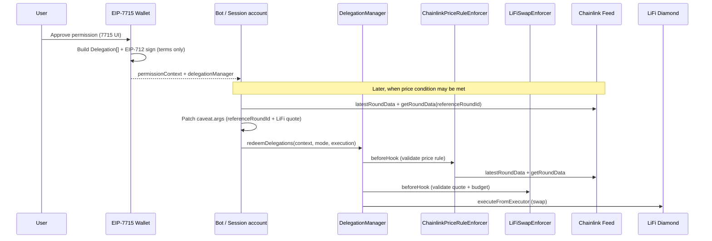

# ChainlinkPriceRuleEnforcer — Wallet Integration Guide (EIP-7715)

This guide is for **wallet implementers** that grant execution permissions via [EIP-7715](https://eips.ethereum.org/EIPS/eip-7715) (`wallet_requestExecutionPermissions`) and want to support the [`ChainlinkPriceRuleEnforcer`](src/enforcers/ChainlinkPriceRuleEnforcer.sol) caveat enforcer.

It is written so a coding agent can implement the integration against this repository without guessing encodings or signing rules.

## Scope

| In scope (v1) | Out of scope (v1) |
|---|---|
| DIP / RISE / ABSOLUTE price rules via Chainlink feeds | On-chain feed registry / allowlist |
| 68-byte packed terms signed at grant time | Sequencer uptime feed integration |
| Stacking with `LiFiSwapEnforcer` and standard enforcers | CLI / lifi-swap tooling for reference rounds |
| Args filled by bot at redemption (`referenceRoundId`) | Price-gated execution without a trusted delegate |

## Architecture overview



The wallet's job ends at **creating and signing delegations**. For relative rules (DIP / RISE), the **bot** supplies `referenceRoundId` in caveat args at each redemption — args are **not** part of the delegation signature hash.

## Required on-chain contracts

Reference deployments (v1.3.0): see [`documents/Deployments.md`](documents/Deployments.md).

| Contract | Role |
|---|---|
| `DelegationManager` | `0xdb9B1e94B5b69Df7e401DDbedE43491141047dB3` — validates delegations; calls enforcer hooks |
| User `DeleGator` | Smart account that holds assets and executes swaps |
| `ChainlinkPriceRuleEnforcer` | `0x4dAEbF9C5813EFF2606acD41BA25e57841e7cb75` (Base mainnet; CREATE2 with salt `GATOR`) |
| `LiFiSwapEnforcer` | `0x64a9B2277dcDD134e78d30bEe11c3056e8E56ffE` — budget, slippage, signed quote |
| `AllowedTargetsEnforcer` | `0x7F20f61b1f09b08D970938F6fa563634d65c4EeB` — pin LiFi diamond |
| `ValueLteEnforcer` | `0x92Bf12322527cAA612fd31a0e810472BBB106A8F` — disallow ETH in execution |
| Chainlink feed proxy | Pinned in terms (e.g. Base ETH/USD) |

Canonical source files:

- Enforcer: [`src/enforcers/ChainlinkPriceRuleEnforcer.sol`](src/enforcers/ChainlinkPriceRuleEnforcer.sol)
- Encoding helpers: [`src/libraries/ChainlinkPriceRuleLib.sol`](src/libraries/ChainlinkPriceRuleLib.sol)
- Feed interface: [`src/interfaces/IAggregatorV3.sol`](src/interfaces/IAggregatorV3.sol)
- Delegation hashing: [`src/libraries/EncoderLib.sol`](src/libraries/EncoderLib.sol)
- Reference tests: [`test/enforcers/ChainlinkPriceRuleEnforcer.t.sol`](test/enforcers/ChainlinkPriceRuleEnforcer.t.sol)

## EIP-7715 integration surface

Your wallet must:

1. Accept a permission request from a dapp (session account / bot as `delegate`).
2. Construct one or more `Delegation` structs with appropriate `Caveat[]`.
3. EIP-712-sign each delegation with the user's DeleGator as `delegator`.
4. Return `permissions.context = abi.encode(Delegation[])` (leaf → root order) and `permissions.delegationManager`.

The bot later calls:

```solidity
delegationManager.redeemDelegations(
    permissionContexts,  // bytes[] — each element is abi.encode(Delegation[])
    modes,               // ModeCode[] — use ModeLib.encodeSimpleSingle() per execution
    executionCallDatas   // bytes[] — ExecutionLib.encodeSingle(target, value, callData)
);
```

See [`documents/DelegationManager.md`](documents/DelegationManager.md) and [`LiFiSwapEnforcer-Wallet-Integration.md`](LiFiSwapEnforcer-Wallet-Integration.md) for the shared 7715 / 7710 flow.

## Rule kinds

| Value | Constant | User label | When it passes |
|---|---|---|---|
| 0 | `RULE_KIND_DIP` | Buy the dip | Current price fell ≥ `thresholdBps` vs a reference round within `windowSeconds` |
| 1 | `RULE_KIND_RISE` | Take profit / spike | Current price rose ≥ `thresholdBps` vs a reference round within `windowSeconds` |
| 2 | `RULE_KIND_ABSOLUTE_GTE` | Price floor (sell above) | Current price ≥ `triggerPrice` |
| 3 | `RULE_KIND_ABSOLUTE_LTE` | Price ceiling (buy below) | Current price ≤ `triggerPrice` |

Relative rules (DIP / RISE) require `windowSeconds > 0` and `thresholdBps > 0` (< 10000). Absolute rules require `triggerPrice > 0` in feed decimals; set `windowSeconds` and `thresholdBps` to 0.

## ChainlinkPriceRuleEnforcer terms (68 bytes)

Pack with `abi.encodePacked` in this exact order (same as [`ChainlinkPriceRuleLib.encodeTerms`](src/libraries/ChainlinkPriceRuleLib.sol)):

| Offset | Field | Size | Type | Notes |
| --- | --- | --- | --- | --- |
| 0 | `priceFeed` | 20 | `address` | Chainlink **proxy** (not underlying aggregator) |
| 20 | `ruleKind` | 1 | `uint8` | 0–3 — see rule kinds table |
| 21 | `expectedDecimals` | 1 | `uint8` | Must match `feed.decimals()` (1–18) |
| 22 | `windowSeconds` | 4 | `uint32` | For DIP/RISE; 0 for absolute |
| 26 | `thresholdBps` | 2 | `uint16` | e.g. 1000 = 10%; 0 for absolute |
| 28 | `maxStaleSeconds` | 4 | `uint32` | Max age of current round's `updatedAt` |
| 32 | `minGapSeconds` | 4 | `uint32` | Min age of reference round; 0 = only block future timestamps |
| 36 | `triggerPrice` | 32 | `int256` | Feed decimals; 0 for relative rules |

Solidity packing example:

```solidity
bytes memory terms = abi.encodePacked(
    priceFeed,              // address
    uint8(ruleKind),        // 0 = DIP, etc.
    uint8(expectedDecimals), // e.g. 8 for USD pairs
    windowSeconds,          // uint32
    thresholdBps,           // uint16
    maxStaleSeconds,        // uint32
    minGapSeconds,          // uint32
    triggerPrice            // int256
);
require(terms.length == 68, "invalid terms length");
```

TypeScript note: `abi.encodePacked` uses big-endian for fixed-size integers. When decoding manually, read `windowSeconds` as `uint32` from bytes `[22:26]`, etc.

### Args at grant time

Set **`args: ""`** when the user signs. Args are filled by the bot at redemption and are **excluded** from the delegation hash (same as `LiFiSwapEnforcer`).

Redemption-time args:

```solidity
// Relative rules (DIP / RISE)
args = abi.encode(uint80 referenceRoundId);

// Absolute rules (GTE / LTE)
args = abi.encode(uint80(0));  // referenceRoundId ignored
```

## Building delegations — product patterns

### Pattern A: Price-gated swap (primary)

Single delegation with multiple caveats — **all must pass** (AND semantics):

| Caveat | Enforcer | Terms (summary) |
|---|---|---|
| `allowedTargets` | `AllowedTargetsEnforcer` | `abi.encodePacked(lifiDiamond)` |
| `valueLte` | `ValueLteEnforcer` | `abi.encodePacked(uint256(0))` |
| `chainlinkPriceRule` | `ChainlinkPriceRuleEnforcer` | 68 bytes — see below |
| `lifiSwap` | `LiFiSwapEnforcer` | 284 bytes — see [LiFi wallet guide](LiFiSwapEnforcer-Wallet-Integration.md) |

Caveat **order** determines `beforeHook` call order. Put `ChainlinkPriceRuleEnforcer` before or after `LiFiSwapEnforcer` — both must pass regardless of order.

You may also grant a **separate approve delegation** for `inputToken → lifiDiamond` (see LiFi wallet guide).

#### Example: Buy the dip — USDC → ETH (Base)

**Chainlink caveat terms** (ETH/USD feed gates the swap):

```solidity
address constant ETH_USD_FEED = 0x71041dddad3595F9CEd3DcCFBe3D1F4b0a16Bb70;

bytes memory chainlinkTerms = abi.encodePacked(
    ETH_USD_FEED,
    uint8(0),           // RULE_KIND_DIP
    uint8(8),             // expectedDecimals (ETH/USD uses 8 on Base)
    uint32(86400),        // windowSeconds — 24 hours
    uint16(1000),         // thresholdBps — 10%
    uint32(120),          // maxStaleSeconds — 2 min
    uint32(300),          // minGapSeconds — 5 min anti-noise
    int256(0)             // triggerPrice unused for DIP
);
```

**LiFi caveat terms** (2× normal DCA budget when dip triggers):

```solidity
bytes memory lifiTerms = abi.encodePacked(
    lifiDiamond,
    USDC,
    bytes32(uint256(uint160(WETH))),
    bytes32(uint256(uint160(userRecipient))),
    uint256(block.chainid),
    quoteSigner,
    uint256(20e6),        // 20 USDC per period (2× normal 10 USDC)
    uint256(1 days),
    startDate,
    uint256(50)           // 0.5% slippage
);
```

#### Example: Take profit — WETH → USDC (Base)

**Chainlink caveat** (sell when price rose 10% in 12 hours):

```solidity
bytes memory chainlinkTerms = abi.encodePacked(
    ETH_USD_FEED,
    uint8(1),             // RULE_KIND_RISE
    uint8(8),
    uint32(43200),        // 12 hours
    uint16(1000),         // 10%
    uint32(120),
    uint32(300),
    int256(0)
);
```

Alternative: **absolute take-profit** at $4000 ETH (8 decimals → `4000e8`):

```solidity
bytes memory chainlinkTerms = abi.encodePacked(
    ETH_USD_FEED,
    uint8(2),             // RULE_KIND_ABSOLUTE_GTE
    uint8(8),
    uint32(0),
    uint16(0),
    uint32(120),
    uint32(0),
    int256(4000e8)         // triggerPrice in feed decimals
);
```

Flip LiFi terms to sell WETH → USDC (inputToken = WETH, outputAssetId = USDC).

### Pattern B: Price gate only

A standalone `ChainlinkPriceRuleEnforcer` caveat without LiFi — useful for gating arbitrary executions the bot is allowed to perform via other caveats. Same 68-byte terms; bot still supplies `referenceRoundId` for relative rules.

## Feed address verification (critical)

The enforcer does **not** validate `priceFeed` against a registry. A malicious feed address bypasses all price checks.

Your wallet **must**:

1. Hard-verify the feed proxy against the [Chainlink price feed addresses](https://docs.chain.link/data-feeds/price-feeds/addresses) for the target chain.
2. Read `feed.decimals()` on-chain and set `expectedDecimals` to match.
3. Display the verified pair name and proxy address in the approval UI — never trust a feed address supplied by the dapp without verification.

### Base mainnet feeds (verify before use)

| Pair | Proxy address |
|---|---|
| ETH/USD | `0x71041dddad3595F9CEd3DcCFBe3D1F4b0a16Bb70` |
| USDC/USD | `0x7e860098F58bBFC8648a4311b374B1D669a2bc6B` |

## Building the `Delegation` struct

```solidity
struct Delegation {
    address delegate;      // bot / session account (EIP-7715 `to`)
    address delegator;     // user's DeleGator address
    bytes32 authority;     // ROOT_AUTHORITY for root delegation
    Caveat[] caveats;
    uint256 salt;
    bytes signature;       // EIP-712 — filled after signing
}

struct Caveat {
    address enforcer;   // ChainlinkPriceRuleEnforcer address
    bytes terms;        // 68 bytes
    bytes args;         // "" at grant time
}
```

Use `authority = 0xffffffffffffffffffffffffffffffffffffffffffffffffffffffffffffffff` (`ROOT_AUTHORITY` in [`src/DelegationManager.sol`](src/DelegationManager.sol)).

## Delegation signing (EIP-712)

Only `enforcer` and `terms` are hashed per caveat — **`args` is excluded**:

```solidity
// src/libraries/EncoderLib.sol
keccak256(abi.encode(CAVEAT_TYPEHASH, caveat.enforcer, keccak256(caveat.terms)))
```

Sign with `EIP712Domain` where `verifyingContract = delegationManager`. Reference: `signDelegation` in [`test/utils/BaseTest.t.sol`](test/utils/BaseTest.t.sol).

## User-facing approval UI

When presenting the EIP-7715 permission screen, show at minimum:

| Terms field | User-readable label |
|---|---|
| `priceFeed` + verified pair name | "Price source: ETH/USD (Chainlink)" |
| `ruleKind` | "Rule: Buy the dip / Take profit / Price above $X / Price below $X" |
| `thresholdBps` + `windowSeconds` | "Trigger: price moved ≥ X% within Y hours" (relative rules) |
| `triggerPrice` + `expectedDecimals` | "Trigger: price ≥ / ≤ $X" (absolute rules) |
| `maxStaleSeconds` | "Max oracle staleness: N seconds" |
| `minGapSeconds` | "Reference must be at least N seconds old" |
| `delegate` | "Allow [bot/app] to execute when condition is met" |
| LiFi terms (if stacked) | See [LiFi wallet guide](LiFiSwapEnforcer-Wallet-Integration.md) |

Clarify to the user:

- The **bot** monitors Chainlink and chooses when to execute within the signed rules.
- Each swap still requires a **signed LiFi quote** from `quoteSigner` (if LiFi caveat is present).
- The wallet permission alone does not authorize arbitrary calldata or arbitrary prices.

## Execution constraints enforced by the enforcer

At redemption, the enforcer requires:

- **Mode:** single call + default execution (`ModeLib.encodeSimpleSingle()`)
- **Current price:** from `latestRoundData()` on `terms.priceFeed` — never from args
- **Reference price:** from `getRoundData(args.referenceRoundId)` with timestamp and round validation
- **Decimals:** `feed.decimals() == terms.expectedDecimals`
- **afterHook:** no-op (no state writes)

Full reference: [`documents/CaveatEnforcers.md` § ChainlinkPriceRuleEnforcer](documents/CaveatEnforcers.md).

## Wallet checklist

- [ ] Reference `ChainlinkPriceRuleEnforcer` on target chains (Base deployed; others via CREATE2 deploy script)
- [ ] Map EIP-7715 permission request → 68-byte Chainlink terms
- [ ] Verify `priceFeed` against Chainlink feeds list; set `expectedDecimals` from on-chain `decimals()`
- [ ] Set Chainlink caveat `args` to empty at grant time
- [ ] Stack with `AllowedTargetsEnforcer`, `ValueLteEnforcer`, and `LiFiSwapEnforcer` for swap products
- [ ] EIP-712-sign delegation via DelegationManager domain
- [ ] Optionally grant separate approve delegation for LiFi input token
- [ ] Return `permissionContext`, `delegationManager`, and `delegationHash` to the bot
- [ ] Support `disableDelegation` so users can revoke on-chain

## Verification

```bash
cd delegation-framework && forge test --match-contract ChainlinkPriceRuleEnforcerTest -vvv
```

Cross-check terms packing against [`test/enforcers/ChainlinkPriceRuleEnforcer.t.sol`](test/enforcers/ChainlinkPriceRuleEnforcer.t.sol) `_terms` helper.

## Related documentation

- [App integration guide](ChainlinkPriceRuleEnforcer-App-Integration.md) — bot redemption flow
- [LiFi wallet integration](LiFiSwapEnforcer-Wallet-Integration.md) — swap terms and approve delegation
- [Caveat enforcer reference](documents/CaveatEnforcers.md)
- [Delegation manager](documents/DelegationManager.md)
