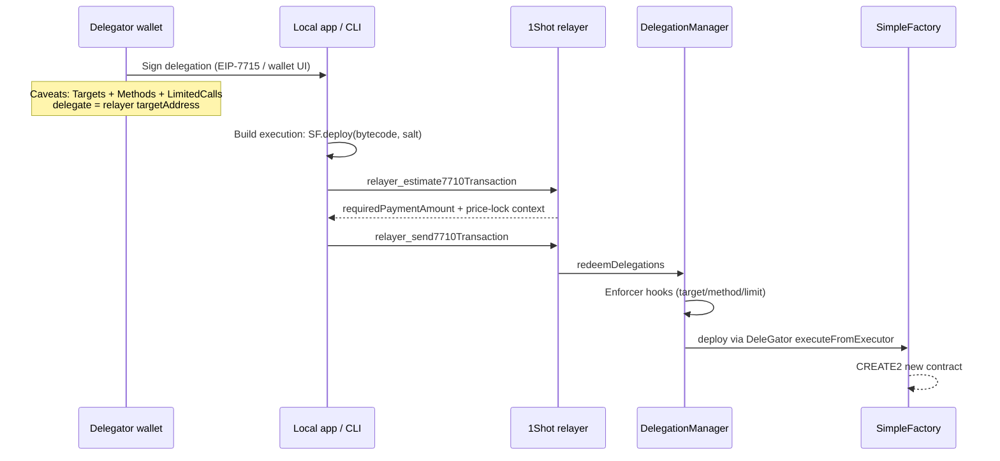

# Delegated contract deployment (no local deployer key)

Design note for deploying smart contracts through ERC-7710 delegated execution and the 1Shot relayer **without putting the delegator’s private key in a local file** (no `.env` `PRIVATE_KEY`, no `forge script --private-key`, etc.).

## Goal

- Deploy arbitrary contract bytecode on-chain via the delegation framework.
- The **delegator** (owner / deployer authority) signs a narrow off-chain delegation in a wallet; a **delegate** (relayer redemption account or local orchestrator) submits the redemption.
- Keys stay in the wallet (MetaMask, 1Shot embedded wallet, passkey). The host only holds the signed delegation `context` and supplies bytecode/salt at execution time.

## Chosen approach (not `DeployedEnforcer`)

Use the canonical **`SimpleFactory`** as the execution target, constrained by standard caveat enforcers:

| Caveat | Enforcer (v1.3.0) | Terms |
|--------|-------------------|-------|
| Target | `AllowedTargetsEnforcer` `0x7F20f61b1f09b08D970938F6fa563634d65c4EeB` | `abi.encodePacked(simpleFactory)` — 20 bytes |
| Method | `AllowedMethodsEnforcer` `0x2c21fD0Cb9DC8445CB3fb0DC5E7Bb0Aca01842B5` | `abi.encodePacked(SimpleFactory.deploy.selector)` — `0x4af63f02` |
| Call budget | `LimitedCallsEnforcer` `0x04658B29F6b82ed55274221a06Fc97D318E25416` | `bytes32(uint256(1))` for one-shot deploy (or higher for N deploys) |

**Why this path**

- Deployment is a normal ERC-7579 **single execution**: call `SimpleFactory.deploy(bytecode, salt)`. No custom deploy hook.
- Bytecode and salt are supplied in **execution calldata at redemption time**, not baked into signed caveat terms.
- Same pattern as other constrained delegations in this repo (e.g. approve onboarding in `LiFiSwapEnforcer-Wallet-Integration.md`).

**Explicitly not the default path:** `DeployedEnforcer` (deploy in `beforeHook`, bytecode in signed terms). That is useful for counterfactual assets (`test/CounterfactualAssetsTest.t.sol`) but is heavier and unnecessary when `SimpleFactory` already exists at a canonical address.

**On salt/bytecode “manipulation”:** If a delegate passes different bytecode or salt, the contract lands at a **different CREATE2 address**. That is not an authority escalation—the delegator only authorized calling `SimpleFactory.deploy`; wrong args → wrong address, not access to the delegator’s keys or assets. No need to pin bytecode in terms for this use case.

## Canonical contracts (v1.3.0)

Same CREATE2 addresses on supported chains — see [`documents/Deployments.md`](documents/Deployments.md).

```
SimpleFactory:       0x69Aa2f9fe1572F1B640E1bbc512f5c3a734fc77c
DelegationManager:   0xdb9B1e94B5b69Df7e401DDbedE43491141047dB3
AllowedTargetsEnforcer:  0x7F20f61b1f09b08D970938F6fa563634d65c4EeB
AllowedMethodsEnforcer:  0x2c21fD0Cb9DC8445CB3fb0DC5E7Bb0Aca01842B5
LimitedCallsEnforcer:    0x04658B29F6b82ed55274221a06Fc97D318E25416
```

`SimpleFactory` API ([`src/utils/SimpleFactory.sol`](src/utils/SimpleFactory.sol)):

```solidity
function deploy(bytes memory _bytecode, bytes32 _salt) external returns (address);
function computeAddress(bytes32 _bytecodeHash, bytes32 _salt) external view returns (address);
```

CREATE2 deployer is **`SimpleFactory`**, not the user’s DeleGator. Predict address with `SimpleFactory.computeAddress(keccak256(bytecode), salt)` (or `vm.computeCreate2Address` / `@openzeppelin/contracts/utils/Create2` off-chain).

Reference tests using `SimpleFactory`: [`test/InviteTest.t.sol`](test/InviteTest.t.sol), [`test/MultiSigDeleGatorTest.t.sol`](test/MultiSigDeleGatorTest.t.sol).

## End-to-end flow



### 1. Wallet signs delegation (no local delegator key)

Prefer **wallet signing**, not `privateKeyToAccount` + `.env`:

- **MetaMask:** `requestExecutionPermissions` via `@metamask/smart-accounts-kit/actions` (`erc7715ProviderActions`).
- **1Shot embedded wallet:** `wallet_requestExecutionPermissions`; decode `context` with `decodeDelegations` from `@metamask/smart-accounts-kit/utils`.

Relayer prerequisites ([`.agents/skills/public-relayer/SKILL.md`](.agents/skills/public-relayer/SKILL.md)):

1. `relayer_getCapabilities(chainId)` → `targetAddress`, `feeCollector`, accepted fee tokens.
2. Delegation **`delegate`** must be **`targetAddress`** (relayer redemption wallet).
3. Delegator must be EIP-7702 smart account (`Implementation.Stateless7702`); first use may require `authorizationList` on estimate/send (signed in wallet, not from file).

Delegation struct ([`src/utils/Types.sol`](src/utils/Types.sol)):

```typescript
{
  delegate: targetAddress,           // from relayer_getCapabilities
  delegator: smartAccount.address,   // user's 7702 account
  authority: ROOT_AUTHORITY,         // 0x0 for root grant
  caveats: [
    { enforcer: ALLOWED_TARGETS,  terms: encodePacked(SIMPLE_FACTORY), args: "" },
    { enforcer: ALLOWED_METHODS, terms: encodePacked(deploySelector), args: "" },
    { enforcer: LIMITED_CALLS,    terms: bytes32(uint256(1)),         args: "" },
  ],
  salt: randomBytes32(),
  signature: "", // filled by wallet EIP-712 sign
}
```

Sign via wallet / `smartAccount.signDelegation` in browser context — **not** by reading `PRIVATE_KEY` from disk.

Optional hardening (not required for this design): `TimestampEnforcer`, `BlockNumberEnforcer`, `RedeemerEnforcer`.

### 2. Build execution (host / CLI at redemption time)

Single execution (mode `ModeLib.encodeSimpleSingle()`):

```typescript
import { encodeFunctionData } from "viem";

const callData = encodeFunctionData({
  abi: [{
    type: "function",
    name: "deploy",
    inputs: [
      { name: "_bytecode", type: "bytes" },
      { name: "_salt", type: "bytes32" },
    ],
    outputs: [{ type: "address" }],
    stateMutability: "nonpayable",
  }],
  functionName: "deploy",
  args: [creationBytecode, salt],
});

const execution = {
  target: SIMPLE_FACTORY,
  value: 0n,
  callData,
};
```

Bytecode source: local `forge build` artifact (`bytecode.object` + constructor args ABI-encoded into creation code), same as any deploy script — but **only bytecode is sent to the relayer**, not a signing key.

Predict address before submit:

```typescript
const bytecodeHash = keccak256(creationBytecode);
const predicted = await publicClient.readContract({
  address: SIMPLE_FACTORY,
  abi: simpleFactoryAbi,
  functionName: "computeAddress",
  args: [bytecodeHash, salt],
});
```

### 3. Relayer submit

Mirror [`scripts/lifi-swap`](scripts/lifi-swap) relayer flow **without** its `PRIVATE_KEY` requirement:

1. Bundle `permissionContext` (signed delegation) + `executions`: `[feeTransfer, deployExecution]`.
2. `relayer_estimate7710Transaction` → adjust fee leg → re-sign if fee scope changed.
3. `relayer_send7710Transaction` with estimate `context` (price lock ~45s).

Relayer URLs: mainnet `https://relayer.1shotapi.com/relayers`; Sepolia/Base Sepolia `https://relayer.1shotapi.dev/relayers`.

Default: **warn and proceed to relayer** on local checks; do not duplicate enforcer logic client-side (see `.cursorrules` lifi-swap guidance).

### 4. Batch deploy + initialize (optional)

DeleGator supports **batch** executions. In one redemption:

1. `SimpleFactory.deploy(bytecode, salt)`
2. Call `predictedAddress.initialize(...)` or setup function

Second execution needs its own caveats if the same delegation should allow it (e.g. add predicted address to `AllowedTargetsEnforcer`, method selectors to `AllowedMethodsEnforcer`, or use a separate post-deploy delegation). Alternatively sign one broader grant up front if the predicted address and init calldata are known when signing.

## Ownership / constructor caveat

CREATE2 runs inside `SimpleFactory`; **constructor `msg.sender` is `SimpleFactory`**, not the user’s DeleGator.

- Pass **explicit owner** in constructor args (e.g. `Ownable(delegatorAddress)`), or
- Use **initializer** pattern: deploy in exec 1, `initialize(delegator)` in exec 2 of a batch.

Do not assume `Ownable(msg.sender)` gives ownership to the delegator.

## What this is not

- **Not** a replacement for framework enforcer deploys at deterministic `GATOR` salt addresses (`script/DeployCaveatEnforcers.s.sol`) — those use a different deployer EOA.
- **Not** native CREATE from the DeleGator ([`documents/PartialERC7579.md`](documents/PartialERC7579.md) — only `SINGLE` and `BATCH` call types).
- **Not** requiring `DeployedEnforcer` unless you want bytecode pinned in signed terms and deploy in `beforeHook`.

## Implementation checklist (one-shot)

Use as agent context to build e.g. `scripts/delegated-deploy/`:

- [ ] **create** — Wallet or EIP-7715 flow: build caveats (Targets + Methods + LimitedCalls → `SimpleFactory.deploy`), sign delegation to relayer `targetAddress`, save JSON (`chainId`, `relayerTargetAddress`, `permissionContext`, enforcer addresses).
- [ ] **deploy** — Load saved delegation; read creation bytecode + salt from CLI or artifact path; `encodeFunctionData` for `deploy`; predict address via `computeAddress`; build fee + deploy executions; estimate + send via relayer.
- [ ] **No `PRIVATE_KEY`** for delegator — wallet / `requestExecutionPermissions` only; optional session key for redelegation (Path B2 in public-relayer skill).
- [ ] **EIP-7702** — Detect `getCode(delegator)`; attach `authorizationList` on first send if account not yet upgraded.
- [ ] **Relayer fee** — ERC-20 transfer to `feeCollector`; delegation scope must cover `feeAmount + 0` work (no token spend for deploy itself unless constructor needs ETH via separate `ValueLteEnforcer` grant).
- [ ] **Output** — Log `predictedAddress`, relayer `taskId`, poll `relayer_getStatus` or webhook.
- [ ] **Validate on-chain** — Enforcer revert = expected failure mode; no client-side abort that skips relayer simulation.

## Key references

| Topic | Location |
|-------|----------|
| SimpleFactory source | [`src/utils/SimpleFactory.sol`](src/utils/SimpleFactory.sol) |
| Deployments / addresses | [`documents/Deployments.md`](documents/Deployments.md) |
| Delegation redemption | [`documents/DelegationManager.md`](documents/DelegationManager.md) |
| Enforcer encodings | [`documents/CaveatEnforcers.md`](documents/CaveatEnforcers.md) |
| Relayer integration | [`.agents/skills/public-relayer/SKILL.md`](.agents/skills/public-relayer/SKILL.md) |
| Staged CLI pattern (adapt without PRIVATE_KEY) | [`scripts/lifi-swap/`](scripts/lifi-swap/) |
| Factory usage in tests | [`test/InviteTest.t.sol`](test/InviteTest.t.sol) |
