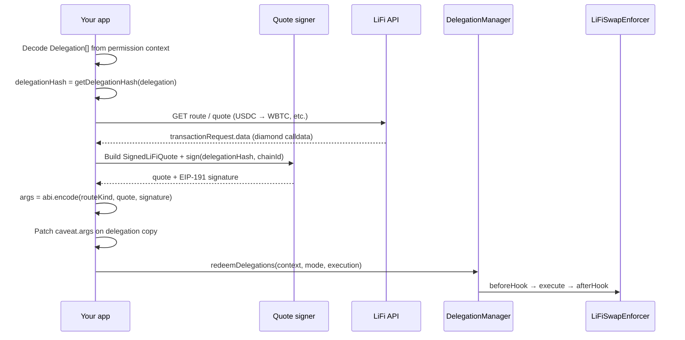

# LiFiSwapEnforcer — App Integration Guide

This guide is for **dapps, automation services, and session accounts** that redeem delegations granted by EIP-7715 wallets using the [`LiFiSwapEnforcer`](src/enforcers/LiFiSwapEnforcer.sol).

It covers the full redemption loop: decode the permission context, obtain a signed LiFi quote, fill caveat args, and call `redeemDelegations`.

## Prerequisites

You receive from the wallet (EIP-7715 response):

| Field | Content |
|---|---|
| `permissions.context` | `abi.encode(Delegation[])` — leaf to root |
| `permissions.delegationManager` | DelegationManager address |
| User `delegator` | DeleGator smart account (holds tokens) |
| `delegate` | Your session account (must match `Delegation.delegate`) |

Additionally:

- The user's DeleGator must have **approved** `inputToken` for the LiFi Diamond (separate onboarding delegation or prior `approve` tx).
- Your backend must operate the **`quoteSigner`** private key pinned in the delegation terms.
- LiFi Diamond address on the source chain must match `terms.lifiDiamond`.

## End-to-end flow



## Step 1 — Decode the permission context

```typescript
// Pseudocode — adapt to your ABI codec
const delegations: Delegation[] = decodeAbi(["Delegation[]"], permissionContext)[0];
const swapDelegation = delegations[delegations.length - 1]; // root if single delegation

const lifiCaveat = swapDelegation.caveats.find(
  (c) => c.enforcer.toLowerCase() === LIFI_SWAP_ENFORCER_ADDRESS.toLowerCase()
);
if (!lifiCaveat) throw new Error("Missing LiFiSwapEnforcer caveat");

const terms = decodeLiFiTerms(lifiCaveat.terms); // 284 bytes — see below
```

### Terms decoder (TypeScript reference)

```typescript
const TERMS_LENGTH = 284;

function decodeLiFiTerms(terms: Hex): LiFiTerms {
  if (terms.length !== 2 + TERMS_LENGTH * 2) throw new Error("invalid terms length"); // 0x + hex
  const buf = hexToBytes(terms);
  return {
    lifiDiamond: bytesToAddress(buf.slice(0, 20)),
    inputToken: bytesToAddress(buf.slice(20, 40)),
    outputAssetId: bytes32(buf.slice(40, 72)),
    outputRecipient: bytes32(buf.slice(72, 104)),
    destinationChainId: bytesToBigInt(buf.slice(104, 136)),
    quoteSigner: bytesToAddress(buf.slice(136, 156)),
    periodAmount: bytesToBigInt(buf.slice(156, 188)),
    periodDuration: bytesToBigInt(buf.slice(188, 220)),
    startDate: bytesToBigInt(buf.slice(220, 252)),
    slippageBps: bytesToBigInt(buf.slice(252, 284)),
  };
}
```

Mirror [`LiFiSwapQuoteLib.decodeTerms`](src/libraries/LiFiSwapQuoteLib.sol).

## Step 2 — Compute `delegationHash`

Required for quote signing. Must match on-chain `DelegationManager.getDelegationHash`.

```solidity
// On-chain (view)
bytes32 delegationHash = delegationManager.getDelegationHash(delegation);
```

Off-chain, replicate [`EncoderLib._getDelegationHash`](src/libraries/EncoderLib.sol):

- Hash each caveat as `keccak256(abi.encode(CAVEAT_TYPEHASH, enforcer, keccak256(terms)))`
- **`args` is NOT included** in the caveat hash
- **`signature` is NOT included** in the delegation hash

When computing the hash before redemption, use the delegation as signed by the user (`args = ""` unless the user pre-filled args, which is unusual for this enforcer).

Reference: integration test in [`test/enforcers/LiFiSwapEnforcer.t.sol`](test/enforcers/LiFiSwapEnforcer.t.sol) `test_integration_sameChainSwap` — computes hash with empty args, then sets args before redemption.

## Step 3 — Check remaining budget (optional UI)

```solidity
(
    uint256 available,
    bool isNewPeriod,
    uint256 currentPeriod
) = lifiSwapEnforcer.getAvailableAmount(delegationHash, delegationManager, terms);
```

Revert reasons if budget exhausted: `LiFiSwapEnforcer:period-amount-exceeded`.

## Step 4 — Fetch LiFi route and build diamond calldata

Use the [LiFi API](https://docs.li.fi/) (or your routing layer) to obtain:

- Full **transaction calldata** for the LiFi Diamond on the source chain
- Input amount, expected output, minimum output
- Confirmation that route matches delegation terms (`inputToken`, `outputAssetId`, `outputRecipient`, `destinationChainId`)

**Important:** The enforcer **does** decode the calldata. In addition to the `calldataHash` binding (`keccak256(callData) == quote.calldataHash`, signed by the quote signer), the enforcer decodes the calldata per the `RouteKind` you supply in args (see Step 6a) and asserts that the **recipient** and **destination chain** embedded in the calldata match the signed `terms`. So the calldata must not only hash-match the quote — its recipient and destination-chain fields must also equal `terms.outputRecipient` and `terms.destinationChainId`. A route whose calldata recipient/dest-chain differs from terms will revert even if the hash matches.

Constraints:

- `target = terms.lifiDiamond`
- `value = 0` for ERC20 input, or `value = inputAmount` when `inputToken == address(0)` (native ETH input)
- `callData.length >= 4`
- The calldata's recipient and destination-chain fields must match `terms` (enforced per `RouteKind` — see Step 6a)

Ensure the user's DeleGator is the `msg.sender` from LiFi's perspective (tokens pulled via `transferFrom(delegator, ...)`), which requires prior `approve(lifiDiamond, ...)`.

## Step 5 — Build and sign `SignedLiFiQuote`

### Struct (ABI tuple for encoding)

```solidity
struct SignedLiFiQuote {
    address delegator;           // swapDelegation.delegator
    address lifiDiamond;         // must match terms
    address inputToken;          // must match terms
    bytes32 outputAssetId;       // must match terms
    bytes32 outputRecipient;     // must match terms
    uint256 destinationChainId;  // must match terms
    uint256 inputAmount;         // consumed from period budget
    uint256 expectedAmountOut;   // from LiFi quote
    uint256 minAmountOut;        // from LiFi quote; must pass slippage check
    bytes32 calldataHash;        // keccak256(diamondCalldata)
    uint256 expiration;          // unix timestamp; must be > block.timestamp at redemption
}
```

All quote fields except `inputAmount` / amounts / `calldataHash` / `expiration` must match the signed **terms**. `delegator` must match the delegator passed to `beforeHook`.

### Quote hash and signature (EIP-191 personal sign)

```solidity
// src/libraries/LiFiSwapQuoteLib.sol
bytes32 digest = keccak256(abi.encode(quote, quote.expiration, delegationHash, block.chainid));
bytes32 ethSigned = toEthSignedMessageHash(digest); // EIP-191: "\x19Ethereum Signed Message:\n32" ++ digest
bytes memory signature = ecdsaSign(quoteSignerPrivateKey, ethSigned);
```

**Replay binding:** Quotes are valid only for the specific `delegationHash` and source `chainId`. A quote signed for delegation A fails on delegation B.

Verify locally before submitting:

```solidity
recoverQuoteSigner(quote, delegationHash, signature) == terms.quoteSigner
```

Only the address pinned in `terms.quoteSigner` may sign — typically your backend, not the user's wallet key.

### Slippage check (enforced on-chain)

```solidity
minAmountOut >= expectedAmountOut * (10000 - terms.slippageBps) / 10000
```

If this fails: `LiFiSwapEnforcer:slippage-exceeded`. Your quote signer should pre-validate before signing.

## Step 6 — Encode caveat args

Args are a **3-tuple with `RouteKind` first** — the enforcer decodes them as
`(RouteKind, SignedLiFiQuote, bytes)` in `LiFiSwapEnforcer._decodeArgs` ([src/enforcers/LiFiSwapEnforcer.sol](src/enforcers/LiFiSwapEnforcer.sol)). Order matters: `RouteKind` must be the first element because that is the order `_decodeArgs` expects.

```solidity
LiFiSwapQuoteLib.RouteKind routeKind = LiFiSwapQuoteLib.RouteKind.EvmBridge; // pick per route — see Step 6a
bytes memory args = abi.encode(routeKind, quote, signature);
```

Set on the caveat **copy** you pass to `redeemDelegations` (do not mutate the user's signed delegation if you cache it — args are not in the delegation hash, so patching args on a copy is standard):

```typescript
lifiCaveat.args = encodeAbiParameters(
  [
    { type: "uint8", name: "routeKind" }, // RouteKind enum (0..3), see Step 6a
    { type: "tuple", components: [/* SignedLiFiQuote fields */] },
    { type: "bytes" },
  ],
  [routeKind, quote, signature]
);
```

`RouteKind` is **not signed** by the quote signer — it lives in args, which are excluded from the delegation hash. The enforcer cross-checks it against the calldata selector and `terms` shape before its decode path runs, so a wrong value reverts rather than picking a weak decode path. See Step 6a for how to pick it.

## Step 6a — RouteKind: selecting the decode branch

`RouteKind` (`src/libraries/LiFiSwapQuoteLib.sol`) is an enum (0..3) that tells the enforcer which calldata layout to decode. It is supplied in args (see Step 6) and is **not** part of the signed quote. Each branch cross-checks the enum against the calldata's 4-byte selector and the `terms` shape, then decodes the recipient and destination-chain fields and asserts they equal `terms.outputRecipient` and `terms.destinationChainId`.

| Value | Name | Route | LiFi facet / selectors | What the enforcer decodes & enforces |
| --- | --- | --- | --- | --- |
| 0 | `SameChain` | Same-chain EVM swap | `GenericSwapFacetV3` (`0x4666fc80` `0x733214a3` `0xaf7060fd` `0x2c57e884` `0x5fd9ae2e` `0x736eac0b`) | Requires `terms.destinationChainId == block.chainid` and a clean-EVM `outputRecipient`. Decodes the `_receiver` (4th param head @ calldata `0x64`) and asserts it equals `terms.outputRecipient`. |
| 1 | `EvmBridge` | EVM-to-EVM bridge | Selector-agnostic; decodes `ILiFi.BridgeData` | Requires `terms.destinationChainId != block.chainid` and a clean-EVM `outputRecipient`. Decodes `BridgeData.receiver` (offset `+0xA0`) and `BridgeData.destinationChainId` (offset `+0xE0`); rejects the non-EVM sentinel; asserts both equal `terms`. |
| 2 | `NearBtc` | EVM-to-BTC via NEAR Intents | `NEARIntentsFacet` (`0x5cf8113b` `0x3110c7b9`) | Requires `terms.destinationChainId != block.chainid` and a **non-clean** `outputRecipient`. Decodes `nonEVMReceiver` (1st field of the bridge-specific struct, offset `0x00`) and `BridgeData.destinationChainId`; asserts both equal `terms`. |
| 3 | `LayerSwapBtc` | EVM-to-BTC via LayerSwap | `LayerSwapFacet` (`0xee9e98e0` `0x4c279d6b`) | Requires `terms.destinationChainId != block.chainid` and a **non-clean** `outputRecipient`. Decodes `nonEVMReceiver` (4th field of the bridge-specific struct, offset `0x60`) and `BridgeData.destinationChainId`; asserts both equal `terms`. |

**How to pick `RouteKind`:** derive it from the LiFi route you fetched in Step 4.

- If the route is a same-chain swap (destination chain == source chain, EVM recipient) → `SameChain` (0).
- If the route is an EVM-to-EVM cross-chain bridge → `EvmBridge` (1).
- If the route bridges to Bitcoin via NEAR Intents → `NearBtc` (2).
- If the route bridges to Bitcoin via LayerSwap → `LayerSwapBtc` (3).

A lying `RouteKind` reverts: each branch checks the calldata selector against the expected set for that route and checks the `terms` shape (clean vs non-clean EVM recipient, same vs cross chain), so passing `SameChain` for a BTC bridge (or vice versa) fails with `route-selector-mismatch` / `route-recipient-shape-mismatch` / `route-dest-chain-mismatch` rather than decoding under the wrong layout.

Reference: `_verifyCalldataMatchesTerms` and the four `_verify*` branches in [`src/enforcers/LiFiSwapEnforcer.sol`](src/enforcers/LiFiSwapEnforcer.sol).

## Step 7 — Encode execution and call `redeemDelegations`

### Execution calldata format

Single execution uses packed encoding (not standard ABI tuple):

```solidity
// ExecutionLib.encodeSingle
bytes memory executionCallData = abi.encodePacked(target, value, callData);
// target: 20 bytes, value: 32 bytes, callData: variable
```

### Mode

```solidity
ModeCode mode = ModeLib.encodeSimpleSingle();
// CALLTYPE_SINGLE + EXECTYPE_DEFAULT
```

### Full call

```solidity
bytes[] memory permissionContexts = new bytes[](1);
permissionContexts[0] = abi.encode(delegations); // with updated caveat.args

ModeCode[] memory modes = new ModeCode[](1);
modes[0] = ModeLib.encodeSimpleSingle();

bytes[] memory executionCallDatas = new bytes[](1);
executionCallDatas[0] = ExecutionLib.encodeSingle(
    terms.lifiDiamond,
    0,
    diamondCalldata
);

delegationManager.redeemDelegations(permissionContexts, modes, executionCallDatas);
```

### ERC-4337 path

The user's DeleGator can call `redeemDelegations` via UserOp — see `invokeDelegation_UserOp` in [`test/utils/BaseTest.t.sol`](test/utils/BaseTest.t.sol).

Your **session account** (delegate) typically submits the UserOp or transaction that triggers redemption, depending on your 7715 setup.

## Step 8 — Handle `afterHook` behavior

| Scenario | On-chain outcome |
|---|---|
| Same-chain + EVM `outputRecipient` + EVM `outputAssetId` | `afterHook` verifies recipient balance increased by ≥ `quote.minAmountOut` |
| Same-chain + EVM `outputRecipient` + `bytes32(0)` output | `afterHook` verifies `recipient.balance` increased by ≥ `quote.minAmountOut` (native ETH) |
| Cross-chain or non-EVM recipient | `afterHook` silently no-ops; bridge initiation is the last enforced step |

Do not rely on source-chain balance checks for cross-chain delivery confirmation.

## Revert strings reference

| Revert | Cause |
|---|---|
| `LiFiSwapQuoteLib:invalid-terms-length` | Terms ≠ 284 bytes |
| `LiFiSwapEnforcer:invalid-zero-diamond` | `terms.lifiDiamond == address(0)` |
| `LiFiSwapEnforcer:invalid-zero-quote-signer` | `terms.quoteSigner == address(0)` |
| `LiFiSwapEnforcer:invalid-zero-output-recipient` | `terms.outputRecipient == bytes32(0)` |
| `LiFiSwapEnforcer:invalid-zero-destination-chain` | `terms.destinationChainId == 0` |
| `LiFiSwapEnforcer:invalid-zero-period-amount` | `terms.periodAmount == 0` |
| `LiFiSwapEnforcer:invalid-zero-period-duration` | `terms.periodDuration == 0` |
| `LiFiSwapEnforcer:invalid-zero-start-date` | `terms.startDate == 0` |
| `LiFiSwapEnforcer:invalid-slippage-bps` | `slippageBps >= 10000` |
| `LiFiSwapEnforcer:invalid-target` | Execution target ≠ `lifiDiamond` |
| `LiFiSwapEnforcer:invalid-native-value` | `inputToken == address(0)` but `value ≠ quote.inputAmount` |
| `LiFiSwapEnforcer:invalid-value` | `inputToken != address(0)` but `value != 0` |
| `LiFiSwapEnforcer:invalid-calldata-length` | `callData.length < 4` |
| `LiFiSwapEnforcer:quote-expired` | `block.timestamp >= quote.expiration` |
| `LiFiSwapEnforcer:invalid-quote-signature` | Wrong signer or wrong delegationHash/chainId in digest |
| `LiFiSwapEnforcer:calldata-hash-mismatch` | Execution calldata ≠ signed `quote.calldataHash` |
| `LiFiSwapEnforcer:invalid-delegator` | `quote.delegator ≠ _delegator` |
| `LiFiSwapEnforcer:invalid-diamond` | `quote.lifiDiamond ≠ terms.lifiDiamond` |
| `LiFiSwapEnforcer:invalid-input-token` | `quote.inputToken ≠ terms.inputToken` |
| `LiFiSwapEnforcer:invalid-output-asset` | `quote.outputAssetId ≠ terms.outputAssetId` |
| `LiFiSwapEnforcer:invalid-output-recipient` | `quote.outputRecipient ≠ terms.outputRecipient` |
| `LiFiSwapEnforcer:invalid-destination-chain` | `quote.destinationChainId ≠ terms.destinationChainId` |
| `LiFiSwapEnforcer:slippage-exceeded` | `minAmountOut` too low vs `expectedAmountOut` and `slippageBps` |
| `LiFiSwapEnforcer:invalid-zero-input-amount` | `quote.inputAmount == 0` |
| `LiFiSwapEnforcer:swap-not-started` | First swap before `terms.startDate` |
| `LiFiSwapEnforcer:period-amount-exceeded` | `inputAmount` over remaining period budget |
| `LiFiSwapEnforcer:calldata-too-short` | Calldata too short to read a required 32-byte word (attacker-controlled offset guard) |
| `LiFiSwapEnforcer:unsupported-route` | `RouteKind` not in 0..3, or NEAR/LayerSwap offset mismatch |
| `LiFiSwapEnforcer:route-dest-chain-mismatch` | `RouteKind` implies same-chain but `terms.destinationChainId != block.chainid` (or vice versa) |
| `LiFiSwapEnforcer:route-recipient-shape-mismatch` | `RouteKind` expects clean-EVM recipient but `terms.outputRecipient` is non-clean (or vice versa) |
| `LiFiSwapEnforcer:route-selector-mismatch` | Calldata selector not in the set allowed for the given `RouteKind` |
| `LiFiSwapEnforcer:non-evm-sentinel-receiver` | `EvmBridge` route but calldata `BridgeData.receiver` is the non-EVM sentinel |
| `LiFiSwapEnforcer:calldata-recipient-mismatch` | Decoded calldata recipient ≠ `terms.outputRecipient` |
| `LiFiSwapEnforcer:calldata-dest-chain-mismatch` | Decoded calldata `destinationChainId` ≠ `terms.destinationChainId` |
| `LiFiSwapEnforcer:insufficient-output-received` | Same-chain `afterHook` balance check failed |
| `CaveatEnforcer:invalid-call-type` | Batch mode used instead of single |
| `CaveatEnforcer:invalid-execution-type` | Try execution mode used instead of default |

Always **simulate** (`eth_call`) before submitting. Also check `delegationManager.disabledDelegations(delegationHash)`.

## Quote signer backend checklist

- [ ] Load LiFi route; extract `transactionRequest.to`, `.data`, amounts
- [ ] Assert route matches delegation terms (token, asset id, recipient, dest chain)
- [ ] Set `calldataHash = keccak256(diamondCalldata)`
- [ ] Validate slippage off-chain before signing
- [ ] Sign with EIP-191 over `hashQuote(quote, delegationHash)` including `chainId`
- [ ] Use short `expiration` (e.g. 5–15 minutes) unless you accept replay within the window
- [ ] Return `{ quote, signature }` to the app executor

Within the same delegation and expiration window, **replay is possible** but bounded by period budget and calldata idempotency. Track executed quotes off-chain if you need stricter once-only semantics.

## Example: same-chain USDC → WBTC DCA

**Delegation terms (set by wallet):**

```solidity
abi.encodePacked(
    lifiDiamond,
    USDC,
    bytes32(uint256(uint160(WBTC))),
    bytes32(uint256(uint160(userWallet))),
    uint256(block.chainid),
    quoteSigner,
    uint256(10e6),      // 10 USDC per period
    uint256(1 days),
    startDate,
    uint256(50)         // 0.5% max slippage
)
```

**Per execution (your backend):**

1. LiFi quote: 10 USDC → WBTC, `minAmountOut` from route
2. Build `SignedLiFiQuote` with `inputAmount = 10e6`
3. Sign with `delegationHash` + `chainId`
4. Redeem with diamond calldata from LiFi `transactionRequest.data`

## Example: cross-chain USDC → BTC

Terms use LiFi API `bytes32` for BTC asset id and recipient, and LiFi BTC `destinationChainId` (e.g. `20000000000001`). `afterHook` will not verify destination delivery — monitor bridge status via LiFi tooling.

## Contract addresses

| Contract | v1.3.0 (most chains) |
|---|---|
| `DelegationManager` | `0xdb9B1e94B5b69Df7e401DDbedE43491141047dB3` |
| `LiFiSwapEnforcer` | `0x64a9B2277dcDD134e78d30bEe11c3056e8E56ffE` — see [`documents/Deployments.md`](documents/Deployments.md) for the canonical address per environment. Note: an upgradeable `TransparentUpgradeableProxy` wrapper is being introduced; new delegations should reference the **proxy** address (logged by `script/DeployLiFiSwapEnforcer.s.sol`), while existing signed delegations keep hitting the non-upgradeable enforcer above. |

LiFi Diamond: use [`deployments/`](https://github.com/lifinance/contracts/tree/main/deployments) from the LI.FI contracts repo for your network.

## Testing your integration

1. Run repo tests: `forge test --match-contract LiFiSwapEnforcer -vvv`
2. Fork-test redemption against deployed DelegationManager + your enforcer
3. Verify quote signature recovery matches `terms.quoteSigner`
4. Confirm `getAvailableAmount` decrements after successful redemption

## Related documentation

- [Wallet integration guide](LiFiSwapEnforcer-Wallet-Integration.md) — EIP-7715 grant flow
- [Caveat enforcer reference](documents/CaveatEnforcers.md)
- [Delegation manager](documents/DelegationManager.md)
