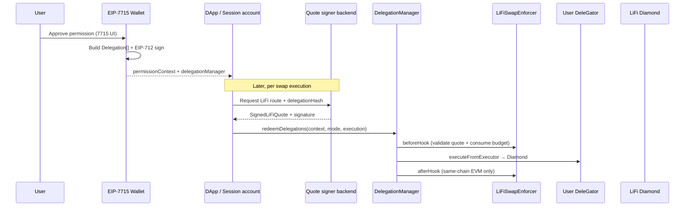

# LiFiSwapEnforcer — Wallet Integration Guide (EIP-7715)

This guide is for **wallet implementers** that grant execution permissions via [EIP-7715](https://eips.ethereum.org/EIPS/eip-7715) (`wallet_requestExecutionPermissions`) and want to support the [`LiFiSwapEnforcer`](src/enforcers/LiFiSwapEnforcer.sol) caveat enforcer.

It is written so a coding agent can implement the integration against this repository without guessing encodings or signing rules.

## Scope

| In scope (v1) | Out of scope (v1) |
|---|---|
| Same-chain LiFi swaps and cross-chain LiFi bridges | `DelegationLiFiSwapAdapter` (not implemented) |
| Periodic input budget, slippage cap, pinned assets/recipient/chain | Native-fee bridges (`msg.value > 0`) |
| Signed per-execution quotes supplied by a trusted backend at redemption | Batch `[approve, swap]` in one redemption |
| Separate onboarding delegation for ERC-20 `approve` | Facet-specific calldata decoding in the enforcer |

## Architecture overview



The wallet's job ends at **creating and signing delegations**. Per-execution quote signing is done by a **quote signer backend** (configured in terms), not the wallet.

## Required on-chain contracts

Reference deployments (v1.3.0, same address on most supported chains): see [`documents/Deployments.md`](documents/Deployments.md).

| Contract | Role |
|---|---|
| `DelegationManager` | Validates delegations; calls enforcer hooks; triggers `executeFromExecutor` on the user's DeleGator |
| User `DeleGator` (Hybrid / MultiSig / EIP-7702) | Smart account that holds assets and executes LiFi calls |
| `LiFiSwapEnforcer` | `0x64a9B2277dcDD134e78d30bEe11c3056e8E56ffE` (CREATE2; same address on all deployed chains) — see [`documents/Deployments.md`](documents/Deployments.md) for the canonical address per environment. Note: an upgradeable `TransparentUpgradeableProxy` wrapper is being introduced; new delegations should reference the **proxy** address (logged by `script/DeployLiFiSwapEnforcer.s.sol`), while existing signed delegations keep hitting the non-upgradeable enforcer above. |
| `AllowedTargetsEnforcer` + `AllowedMethodsEnforcer` | Recommended for the separate **approve onboarding** delegation |
| LiFi Diamond (source chain) | Swap/bridge entrypoint — address pinned in terms |

Canonical source files:

- Enforcer: [`src/enforcers/LiFiSwapEnforcer.sol`](src/enforcers/LiFiSwapEnforcer.sol)
- Encoding/signing helpers: [`src/libraries/LiFiSwapQuoteLib.sol`](src/libraries/LiFiSwapQuoteLib.sol)
- Delegation hashing: [`src/libraries/EncoderLib.sol`](src/libraries/EncoderLib.sol)
- Types: [`src/utils/Types.sol`](src/utils/Types.sol)
- Reference tests: [`test/enforcers/LiFiSwapEnforcer.t.sol`](test/enforcers/LiFiSwapEnforcer.t.sol)

## EIP-7715 integration surface

EIP-7715 grants permissions that are redeemed via [EIP-7710](https://eips.ethereum.org/EIPS/eip-7710) `redeemDelegations` on the returned `delegationManager`.

Your wallet must:

1. Accept a permission request from a dapp (session account as `delegate`).
2. Construct one or more `Delegation` structs with appropriate `Caveat[]`.
3. EIP-712-sign each delegation with the user's DeleGator as `delegator`.
4. Return `permissions.context = abi.encode(Delegation[])` (leaf → root order) and `permissions.delegationManager`.

The dapp/session account later calls:

```solidity
delegationManager.redeemDelegations(
    permissionContexts,  // bytes[] — each element is abi.encode(Delegation[])
    modes,               // ModeCode[] — use ModeLib.encodeSimpleSingle() per execution
    executionCallDatas   // bytes[] — ExecutionLib.encodeSingle(target, value, callData)
);
```

See [`documents/DelegationManager.md`](documents/DelegationManager.md) and the test helper `invokeDelegation_UserOp` in [`test/utils/BaseTest.t.sol`](test/utils/BaseTest.t.sol).

## Two delegations the wallet should support

LiFi swaps require **ERC-20 approval** to the LiFi Diamond. The enforcer does **not** handle approval. Support two permission grants:

### 1. Onboarding: approve delegation (one-time or long-lived)

Allows the delegate to call `inputToken.approve(lifiDiamond, amount)` on the user's DeleGator.

Example caveat composition (same pattern as MetaSwap tests in [`test/helpers/DelegationMetaSwapAdapter.t.sol`](test/helpers/DelegationMetaSwapAdapter.t.sol)):

| Caveat | Enforcer | Terms (summary) |
|---|---|---|
| Target | `AllowedTargetsEnforcer` | `abi.encodePacked(inputToken)` |
| Method | `AllowedMethodsEnforcer` | `abi.encodePacked(IERC20.approve.selector)` |
| Calldata | `AllowedCalldataEnforcer` | Spender offset + `lifiDiamond` as `bytes32` |
| Redeemer (optional) | `RedeemerEnforcer` | Session account address |

Pin `approve(spender, type(uint256).max)` or a bounded amount via `AllowedCalldataEnforcer` if you want a cap.

### 2. Swap delegation: `LiFiSwapEnforcer`

Single caveat with **284-byte terms** (see below). Set **`args: ""`** at grant time — args are filled by the quote signer at each redemption and are **not** part of the delegation signature hash.

## LiFiSwapEnforcer terms (284 bytes)

Pack with `abi.encodePacked` in this exact order (same as [`LiFiSwapQuoteLib.encodeTerms`](src/libraries/LiFiSwapQuoteLib.sol)):

| Offset | Field | Size | Type | Notes |
| --- | --- | --- | --- | --- |
| 0 | `lifiDiamond` | 20 | `address` | LiFi Diamond on **source** chain |
| 20 | `inputToken` | 20 | `address` | Source-chain ERC-20 (e.g. USDC), or `address(0)` for native ETH |
| 40 | `outputAssetId` | 32 | `bytes32` | Desired output asset (LiFi/API encoding), or `bytes32(0)` for native ETH |
| 72 | `outputRecipient` | 32 | `bytes32` | EVM or non-EVM recipient |
| 104 | `destinationChainId` | 32 | `uint256` | EVM `chainId` or LiFi non-EVM id |
| 136 | `quoteSigner` | 20 | `address` | Backend that signs per-execution quotes |
| 156 | `periodAmount` | 32 | `uint256` | Max **input** token units per period |
| 188 | `periodDuration` | 32 | `uint256` | Period length in seconds |
| 220 | `startDate` | 32 | `uint256` | Unix timestamp when budget schedule starts |
| 252 | `slippageBps` | 32 | `uint256` | Max slippage; **must be < 10000** (50 = 0.5%) |

Solidity packing example:

```solidity
bytes memory terms = abi.encodePacked(
    lifiDiamond,
    inputToken,
    outputAssetId,
    outputRecipient,
    destinationChainId,
    quoteSigner,
    periodAmount,
    periodDuration,
    startDate,
    slippageBps
);
require(terms.length == 284, "invalid terms length");
```

### Recipient and asset encoding (`bytes32`)

The enforcer checks **equality** only; it does not validate address format.

| Destination | Encoding |
|---|---|
| EVM address | `bytes32(uint256(uint160(evmAddress)))` |
| Native ETH | `bytes32(0)` — the enforcer verifies output via `recipient.balance` in `afterHook` |
| Solana / Bitcoin / other non-EVM | Use LiFi API `bytes32` representation — must match what the quote signer uses |

For same-chain DCA with on-chain output verification, set:

- `outputAssetId = bytes32(uint256(uint160(outputTokenAddress)))` (or `bytes32(0)` for native ETH)
- `outputRecipient = bytes32(uint256(uint160(recipientAddress)))`
- `destinationChainId = block.chainid`

Non-EVM chain IDs (e.g. Bitcoin) come from the LiFi API — do not hardcode without verifying against LiFi tooling.

## Building the swap `Delegation` struct

```solidity
struct Delegation {
    address delegate;      // session account (EIP-7715 `to`)
    address delegator;     // user's DeleGator address
    bytes32 authority;     // ROOT_AUTHORITY for root delegation
    Caveat[] caveats;
    uint256 salt;          // unique per grant if needed
    bytes signature;       // EIP-712 — filled after signing
}

struct Caveat {
    address enforcer;   // LiFiSwapEnforcer address
    bytes terms;        // 284 bytes — see above
    bytes args;         // "" at grant time
}
```

Use `authority = 0xffffffffffffffffffffffffffffffffffffffffffffffffffffffffffffffff` (`ROOT_AUTHORITY` in [`src/DelegationManager.sol`](src/DelegationManager.sol)) for a root-level swap permission.

You may add **other caveats** in the same delegation (e.g. `RedeemerEnforcer`, `TimestampEnforcer`) — all must pass at redemption. Keep the `LiFiSwapEnforcer` caveat's `terms` as specified above.

## Delegation signing (EIP-712)

Delegations are signed with the DelegationManager EIP-712 domain (`delegationManager.getDomainHash()`).

**Critical:** Only `enforcer` and `terms` are hashed per caveat — **`args` and `signature` are excluded** from the delegation hash:

```solidity
// src/libraries/EncoderLib.sol
keccak256(abi.encode(CAVEAT_TYPEHASH, caveat.enforcer, keccak256(caveat.terms)))
```

Full delegation hash:

```solidity
keccak256(abi.encode(
    DELEGATION_TYPEHASH,
    delegation.delegate,
    delegation.delegator,
    delegation.authority,
    keccak256(abi.encodePacked(caveatPacketHashes)),
    delegation.salt
))
```

Type definitions: [`src/utils/Constants.sol`](src/utils/Constants.sol).

Sign with `EIP712Domain` where `verifyingContract = delegationManager` (see `DelegationManager.getDomainHash()`). For contract delegators (DeleGator), use ERC-1271; for EOAs, ECDSA.

Reference implementation: `signDelegation` in [`test/utils/BaseTest.t.sol`](test/utils/BaseTest.t.sol).

### Delegation hash for quote binding

Apps and the quote signer need `delegationHash = DelegationManager.getDelegationHash(delegation)` (with `args = ""` and empty `signature` when computing the hash for signing purposes — match how the hash is computed on-chain).

The quote signature binds this hash (see App integration guide). Wallets should expose `delegationHash` in the permission response metadata if the dapp needs it before first redemption.

## User-facing approval UI

When presenting the EIP-7715 permission screen, show at minimum:

| Field | User-readable label |
|---|---|
| `inputToken` + `periodAmount` + `periodDuration` | "Spend up to X USDC per day/week" |
| `outputAssetId` + `destinationChainId` | "Swap to [asset] on [chain]" |
| `outputRecipient` | "Deliver to [address]" |
| `slippageBps` | "Max slippage: Y%" |
| `quoteSigner` | "Quotes signed by [trusted party]" |
| `lifiDiamond` | "Via LiFi on [network]" |
| `startDate` | "Starts on [date]" |
| `delegate` | "Allow [app/session] to execute" |

Clarify that **each execution still requires a signed quote** from `quoteSigner` within the signed terms — the wallet permission alone does not authorize arbitrary LiFi calldata.

## Execution constraints enforced by the enforcer

When the dapp redeems, the enforcer requires:

- **Mode:** single call + default execution (`ModeLib.encodeSimpleSingle()`)
- **Target:** `terms.lifiDiamond`
- **Value:** `0` for ERC20 input, or `inputAmount` when `inputToken == address(0)` (native ETH input)
- **Calldata hash:** `keccak256(callData) == quote.calldataHash` (signed by quote signer)
- **Calldata shape:** the enforcer decodes the calldata per the `RouteKind` supplied in args and asserts the **recipient** and **destination chain** embedded in the calldata equal `terms.outputRecipient` and `terms.destinationChainId`. The calldata must therefore match terms not only by hash but also by decoded recipient/dest-chain. See the App integration guide's "RouteKind: selecting the decode branch" section for the per-route decode rules.
- **Args:** must carry a `RouteKind` (0=SameChain, 1=EvmBridge, 2=NearBtc, 3=LayerSwapBtc) as the first element of the 3-tuple `(RouteKind, SignedLiFiQuote, signature)`. The wallet sets `args = ""` at grant time; the dapp/quote-signer fills `RouteKind` + quote + signature at redemption. `RouteKind` is not in the delegation hash.
- **Period budget:** `quote.inputAmount` consumed from `(delegationManager, delegationHash)` allowance
- **Slippage:** `quote.minAmountOut >= quote.expectedAmountOut * (10000 - slippageBps) / 10000`

Same-chain EVM swaps also get an `afterHook` balance check on the output token at `outputRecipient`. Cross-chain / non-EVM: no destination verification on source chain.

Full reference: [`documents/CaveatEnforcers.md` § LiFiSwapEnforcer](documents/CaveatEnforcers.md).

## Wallet checklist

- [ ] Deploy or reference `LiFiSwapEnforcer` on target chains
- [ ] Map EIP-7715 permission request → `LiFiSwapEnforcer` terms bytes (284)
- [ ] Set caveat `args` to empty at grant time
- [ ] EIP-712-sign delegation via DelegationManager domain
- [ ] Optionally grant separate approve delegation for `inputToken → lifiDiamond`
- [ ] Return `permissionContext`, `delegationManager`, and `delegationHash` to the dapp
- [ ] Document `quoteSigner` address for the dapp/backend
- [ ] Support `disableDelegation` flow so users can revoke on-chain

## Verification

Run enforcer tests after any wallet-side encoding changes:

```bash
cd delegation-framework && forge test --match-contract LiFiSwapEnforcer -vvv
```

Cross-check terms packing against [`test/enforcers/LiFiSwapEnforcer.t.sol`](test/enforcers/LiFiSwapEnforcer.t.sol) `_buildTerms`.

## Related documentation

- [Caveat enforcer details](documents/CaveatEnforcers.md)
- [Delegation manager](documents/DelegationManager.md)
- [App integration guide](LiFiSwapEnforcer-App-Integration.md) — redemption flow for dapps
