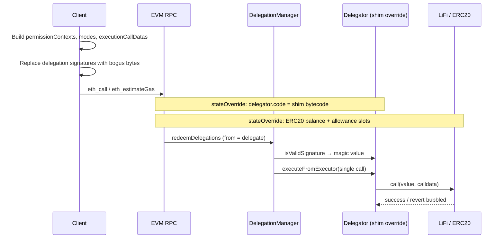

# Delegator estimate shim — relayer integration spec

This document describes the **RPC state-override + DelegatorEstimateShim** gas-estimation PoC implemented in `scripts/lifi-swap`. It is written so a coding agent can add an **estimate-only** path in the 1Shot relayer codebase later.

**Goal:** Quote gas for a **future** `redeemDelegations` execution **without** fresh delegation signatures on every quote, while still running **real enforcer hooks** and **real target calldata** (e.g. LiFi diamond).

**Non-goal:** Replace `relayer_estimate7710Transaction` for submit-time pricing, or weaken signature checks on `relayer_send7710Transaction`.

---

## Problem

`DelegationManager.redeemDelegations` validates each delegation:

- If `delegator.code.length == 0` → EIP-712 + **EOA ECDSA** on the delegation hash.
- Else → **ERC-1271** `isValidSignature(typedDataHash, signature)` on the **delegator** contract.

MetaMask **7702** users have bytecode at the delegator address (`delegatorCodeLength` ≈ 48). Quotes that re-sign delegations on every LiFi route change are expensive UX-wise. Pre-grant estimation needs a simulation that:

1. Skips valid signatures (estimate-only).
2. Still executes the same **batch structure**, **caveats/enforcers**, and **execution calldata** as production.

---

## What this simulates vs what the relayer simulates today

| Aspect | `relayer_estimate7710Transaction` (today) | Shim RPC PoC |
|--------|---------------------------------------------|--------------|
| Signatures | Valid delegation signatures | Placeholder + shim bypass |
| Delegator account | Real **EIP-7702 DeleGator** | **`DelegatorEstimateShim`** injected via state override |
| Entry path | Full **EIP-7710** submit / relay wrapper | Direct **`DelegationManager.redeemDelegations`** |
| `authorizationList` | Included when needed | Not used |
| Token funding | On-chain balances | **ERC-20 storage overrides** (OpenZeppelin layout) |
| Caller (`msg.sender` at DM) | Relayer **`targetAddress`** (delegate) | Same: **delegate / redeem account** |

Observed on Base (`usdc-eth-bridge-2min`, Across routes): RPC shim gas is typically **~2–4% lower** than relayer `gasUsed[8453]`. That gap is mostly **7710 submission overhead**, not swap logic. The shim path measures **redemption + execution** gas correlation; relayer measures **all-in relay submit** gas.

---

## High-level flow



---

## Core contract: `DelegatorEstimateShim`

**Source:** [`src/poc/DelegatorEstimateShim.sol`](src/poc/DelegatorEstimateShim.sol)

**Behavior:**

1. **`isValidSignature`** — always returns `ERC1271Lib.EIP1271_MAGIC_VALUE` (`0x1626ba7e`). Lets `DelegationManager` pass ERC-1271 checks without a real delegator signature.

2. **`executeFromExecutor`** — only callable by `delegationManager` immutable. Decodes **single-default** execution via `ExecutionLib.decodeSingle`, then `target.call{value}(callData)`. On failure, **bubbles** inner revert data (assembly); empty revert → `ExecutionFailed()`.

3. **Not production-safe** — does not implement full `EIP7702DeleGatorCore` (batch modes, try/catch exec types, entrypoint paths, etc.).

**Forge test:** [`test/poc/DelegatorEstimateShim.t.sol`](test/poc/DelegatorEstimateShim.t.sol) — `vm.etch(delegator, shim.code)` + bogus sig → `redeemDelegations` succeeds.

---

## Shim bytecode for state override (not a chain deploy)

The shim is **never deployed on-chain** for this PoC. At simulation time, set:

```text
stateOverride[delegatorAddress].code = DELEGATOR_ESTIMATE_SHIM_RUNTIME
```

**Per-chain `delegationManager`:** The shim constructor bakes in `DelegationManager` as an **immutable**. Runtime bytecode must match the **DelegationManager address on that chain** (e.g. Base mainnet in lifi-swap: `0xdb9B1e94B5b69Df7e401DDbedE43491141047dB3` — confirm from relayer env / deployments).

**Generating runtime hex:**

1. `forge build` (compiles `DelegatorEstimateShim.sol`).
2. Run [`scripts/lifi-swap/scripts/export-shim-bytecode.mjs`](scripts/lifi-swap/scripts/export-shim-bytecode.mjs).

**Critical:** Patch immutables using Foundry artifact **`deployedBytecode.immutableReferences`** only. **Do not** global-replace `000…000` in bytecode — that corrupts opcodes and yields `NotDelegationManager()` at runtime.

Patch rule (same as export script): for each immutable ref `{ start, length: 32 }`, overwrite **bytes 12–31** of that 32-byte word with the 20-byte `delegationManager` address.

Relayer should either:

- Store pre-patched bytecode **per chain** in config, or
- Run equivalent patching at build time when DM address is known.

Reference exported constant (PoC CLI): [`scripts/lifi-swap/src/poc/delegatorEstimateShimBytecode.ts`](scripts/lifi-swap/src/poc/delegatorEstimateShimBytecode.ts).

---

## Bogus delegation signature

**Constant:** [`scripts/lifi-swap/src/pocConstants.ts`](scripts/lifi-swap/src/pocConstants.ts)

```text
BOGUS_DELEGATION_SIGNATURE = 65 bytes of zeros (valid ECDSA length; content irrelevant once shim accepts ERC-1271)
```

Apply to **every** `Delegation` struct in the estimate payload **except** do not use this on **`relayer_send7710Transaction`**.

Delegation **hash** for enforcers does **not** include the signature field (same hash as valid-signed delegation with identical fields).

---

## Calldata: `redeemDelegations`

**Encoder reference:** [`scripts/lifi-swap/src/redeemEncoding.ts`](scripts/lifi-swap/src/redeemEncoding.ts)

**Function:**

```solidity
redeemDelegations(
  bytes[] _permissionContexts,
  bytes32[] _modes,
  bytes[] _executionCallDatas
)
```

For each batch index `i`:

| Field | Content |
|-------|---------|
| `_permissionContexts[i]` | `abi.encode(Delegation[])` — typically one leaf delegation per batch |
| `_modes[i]` | `ModeLib.encodeSimpleSingle()` → 32-byte zero mode in kit (`MODE_SINGLE_DEFAULT`) |
| `_executionCallDatas[i]` | `ExecutionLib.encodeSingle(target, value, callData)` |

**Caller:** `eth_call` / `eth_estimateGas` **`from`** must be the delegation **`delegate`** (relayer `targetAddress` / redeem wallet). `DelegationManager` requires `delegations[0].delegate == msg.sender` (or `ANY_DELEGATE`).

**Target contract:** `to = DelegationManager` for that chain.

**Bundle shape (LiFi swap CLI):** Two batches — see [`scripts/lifi-swap/src/buildEstimateBundle.ts`](scripts/lifi-swap/src/buildEstimateBundle.ts):

1. **Fee batch** — fee delegation → `paymentToken.transfer(feeCollector, feeAmount)`.
2. **Swap batch** — swap delegation → `lifiDiamond.call(diamondCalldata)` (quote-specific).

Relayer implementations should accept the **same** `permissionContexts` / `modes` / `executionCallDatas` they would eventually submit, minus real signatures.

---

## ERC-20 funding state overrides

Enforcers and LiFi still run **real** `transfer` / `transferFrom` logic. If the delegator’s on-chain balance or allowance is insufficient, simulation reverts even with a valid shim.

**Reference:** [`scripts/lifi-swap/src/stateOverride.ts`](scripts/lifi-swap/src/stateOverride.ts)

Assumes **OpenZeppelin ERC20** storage:

- `balances` mapping at slot `0`
- `allowances` mapping at slot `1`

Slots:

```text
balanceSlot(holder)     = keccak256(abi.encode(holder, 0))
allowanceSlot(o, s)     = keccak256(abi.encode(spender, keccak256(abi.encode(owner, 1))))
```

**Typical overrides for LiFi swap from delegator:**

| Need | Override |
|------|----------|
| Swap input | `minBalance >= fromAmount`, `minAllowance >= fromAmount` for `holder = delegator`, `spender = lifiDiamond` |
| Relayer fee (same token) | Increase balance by `feeAmount` on same token override |
| Relayer fee (different token) | Separate token account override for delegator balance |

Use **max** of on-chain read vs required minimum so overrides never reduce existing funds.

**RPC requirement:** Node must support `stateOverride` on `eth_call` and `eth_estimateGas` (Geth-style; many Base providers do).

---

## State override examples

viem expects a **`StateOverride` array** (not a Geth address→object map). Each entry is one account to patch. Merge shim `code` on the delegator with `stateDiff` on ERC-20 contracts.

### PoC (shim + USDC funding) — TypeScript (viem)

Same wiring as [`estimate-gas.ts`](scripts/lifi-swap/src/commands/estimate-gas.ts) and [`stateOverride.ts`](scripts/lifi-swap/src/stateOverride.ts):

```typescript
import type { Address, Hex, StateOverride } from "viem";
import { DELEGATOR_ESTIMATE_SHIM_CODE } from "./poc/delegatorEstimateShimBytecode.js";

const delegator = "0x9fEad8B19C044C2f404dac38B925Ea16ADaa2954" as Address;
const delegate = "0x16E09C6b5ec2382eE79A880A50ea7Fa48045fB34" as Address;
const delegationManager = "0xdb9B1e94B5b69Df7e401DDbedE43491141047dB3" as Address;
const usdc = "0x833589fCD6eDb6E08f4c7C32D4f71b54bdA02913" as Address;
const lifiDiamond = "0x1231DEB6f5749EF6cE6943a275A1D3E7486F4EaE" as Address;

const redeemCalldata: Hex = "0x…"; // encodeRedeemDelegationsCalldata(redeemParams)

// 1) Shim at user delegator (replaces 7702 prefix for this simulation only)
const shimOverride: StateOverride = [
  { address: delegator, code: DELEGATOR_ESTIMATE_SHIM_CODE },
];

// 2) Fund delegator on USDC — slots from buildErc20FundingOverride / OZ layout
//    (values below are illustrative for ~7M balance + max allowance; recompute per holder/spender/amounts)
const fundingOverride: StateOverride = [
  {
    address: usdc,
    stateDiff: [
      {
        slot: "0xba347e5d9819676d309f92073225b30ddc4d404e7c6f7e3e13c32630e19f8a57",
        value:
          "0x00000000000000000000000000000000000000000000000000000000006be204",
      },
      {
        slot: "0xb14f98ca2232a271cc18cbb3acc24265244b5c4f367a4bae9e3e44e07b8bc491",
        value:
          "0xffffffffffffffffffffffffffffffffffffffffffffffffffffffffff1b1e3f",
      },
    ],
  },
];

const stateOverride: StateOverride = [
  ...shimOverride,
  ...fundingOverride,
  // When fee token == swap token, merge into one usdc entry (single address, merged stateDiff)
];

await publicClient.call({
  account: delegate,
  to: delegationManager,
  data: redeemCalldata,
  stateOverride,
});

const gas = await publicClient.estimateGas({
  account: delegate,
  to: delegationManager,
  data: redeemCalldata,
  stateOverride,
});
```

`DELEGATOR_ESTIMATE_SHIM_CODE` is the full runtime hex from [`delegatorEstimateShimBytecode.ts`](scripts/lifi-swap/src/poc/delegatorEstimateShimBytecode.ts) (regenerate after shim Solidity changes).

### Control (funding only, no shim)

Same call, but **omit** the delegator entry — only token `stateDiff`. With bogus delegation signatures this must **revert** (real 7702 delegator still validates ERC-1271):

```typescript
const stateOverride: StateOverride = [...fundingOverride]; // no { address: delegator, code: … }
```

### Geth-style map (equivalent semantics)

Some backends accept the object form under `stateOverride` in JSON-RPC. Logical content matches the viem array above:

```json
{
  "0x9fEad8B19C044C2f404dac38B925Ea16ADaa2954": {
    "code": "0x6080604052…"
  },
  "0x833589fCD6eDb6E08f4c7C32D4f71b54bdA02913": {
    "stateDiff": {
      "0xba347e5d9819676d309f92073225b30ddc4d404e7c6f7e3e13c32630e19f8a57": "0x00000000000000000000000000000000000000000000000000000000006be204",
      "0xb14f98ca2232a271cc18cbb3acc24265244b5c4f367a4bae9e3e44e07b8bc491": "0xffffffffffffffffffffffffffffffffffffffffffffffffffffffffff1b1e3f"
    }
  }
}
```

viem 2.x converts the **array** form internally; do not pass this map to viem’s `stateOverride` unless your client explicitly documents map support.

### Raw `eth_estimateGas` (relayer node → RPC)

```json
{
  "jsonrpc": "2.0",
  "id": 1,
  "method": "eth_estimateGas",
  "params": [
    {
      "from": "0x16E09C6b5ec2382eE79A880A50ea7Fa48045fB34",
      "to": "0xdb9B1e94B5b69Df7e401DDbedE43491141047dB3",
      "data": "0xcef6d209…"
    },
    "latest",
    {
      "0x9fEad8B19C044C2f404dac38B925Ea16ADaa2954": {
        "code": "0x6080604052…"
      },
      "0x833589fCD6eDb6E08f4c7C32D4f71b54bdA02913": {
        "stateDiff": {
          "0xba347e5d9819676d309f92073225b30ddc4d404e7c6f7e3e13c32630e19f8a57": "0x00000000000000000000000000000000000000000000000000000000006be204",
          "0xb14f98ca2232a271cc18cbb3acc24265244b5c4f367a4bae9e3e44e07b8bc491": "0xffffffffffffffffffffffffffffffffffffffffffffffffffffffffff1b1e3f"
        }
      }
    }
  ]
}
```

Slot keys **depend on** `delegator`, `lifiDiamond`, and token layout — always derive with `buildErc20FundingOverride` (or the slot formulas above), not copy-paste from an old quote.

---

## Simulation steps (recommended validation)

Implement in order when adding relayer support:

1. **Control** — bogus sig + ERC-20 overrides, **no** delegator code override → must revert (signature path). Proves overrides alone don’t bypass auth.

2. **PoC** — bogus sig + shim code + funding overrides → `eth_call` must ** succeed** for the full batch list.

3. **`eth_estimateGas`** — same as PoC; only after successful `eth_call`.

4. **Sanity (optional)** — valid signatures + funding overrides + **real** delegator code → should succeed; confirms encoding matches production delegator.

5. **Batch isolation (on PoC failure)** — run batch `[0]` fee-only and `[1]` swap-only with same overrides to locate failing leg. Reference: `sliceRedeemParams` in [`redeemEncoding.ts`](scripts/lifi-swap/src/redeemEncoding.ts).

**Revert decoding:** [`scripts/lifi-swap/src/decodeRevert.ts`](scripts/lifi-swap/src/decodeRevert.ts) — walk viem `cause`, decode `Error(string)`, `Panic`, `DelegationManager` errors, shim errors.

---

## CLI reference implementation

| Piece | Location |
|-------|----------|
| Command orchestration | [`scripts/lifi-swap/src/commands/estimate-gas.ts`](scripts/lifi-swap/src/commands/estimate-gas.ts) |
| Quote + patched swap delegation | [`scripts/lifi-swap/src/prepareSwapRedemption.ts`](scripts/lifi-swap/src/prepareSwapRedemption.ts) |
| Fee + swap bundle | [`scripts/lifi-swap/src/buildEstimateBundle.ts`](scripts/lifi-swap/src/buildEstimateBundle.ts) |
| User docs | [`scripts/lifi-swap/README.md`](scripts/lifi-swap/README.md) § Gas estimate PoC |

**Run locally:**

```bash
cd scripts/lifi-swap
npm run estimate-gas -- <delegation-id> --amount <atoms>
```

---

## Suggested relayer API shape (for implementers)

This repo does **not** define relayer RPC yet. Reasonable design:

**New method (estimate-only), e.g.** `relayer_estimateRedemptionGas` **or** flag on existing estimate:

**Inputs:**

- `chainId`
- `from` (delegate address — must match delegation delegate)
- `permissionContexts`, `modes`, `executionCallDatas` (same as submit, signatures may be omitted or bogus)
- `delegator` (7702 account to override)
- Optional: `funding` hints `{ token, minBalance, spender, minAllowance }[]` — or relayer reads chain and applies same OZ slot math

**Internal steps:**

1. Inject shim bytecode at `delegator` via state override.
2. Substitute bogus signatures on all delegations in contexts (server-side only).
3. `eth_estimateGas({ from: delegate, to: delegationManager, data, stateOverride })`.
4. Return `{ gas, success, revertReason? }` — **do not** treat as submit gas limit for 7710 bundle unless you add wrapper simulation.

**Keep separate:**

- **`requiredPaymentAmount`** — still from fee policy / `relayer_getFeeData` and/or full `relayer_estimate7710Transaction` when signing is available.
- **Submit path** — always real signatures, real delegator code, no shim.

---

## Security and product constraints

- Shim + bogus sig **must never** be accepted on **`relayer_send7710Transaction`** or any path that lands on-chain without state override (overrides exist only inside the RPC simulation).
- State overrides can lie about balances; estimation assumes **user will have funds** at execution time — same as optimistic simulation elsewhere.
- Shim `executeFromExecutor` is **not** byte-identical to `EIP7702StatelessDeleGator`; rare routes might diverge. Sanity check (valid sig, no shim) helps detect that in testing.
- LiFi / enforcer rules still apply: quote signatures, calldata hash, period budget, slippage, etc. Only **delegation signature verification** is bypassed.

---

## Implementation checklist (coding agent)

- [ ] Per-chain `DelegationManager` address and patched shim runtime bytecode.
- [ ] RPC provider that supports `stateOverride` on call + estimate (or internal Geth).
- [ ] Encode/decode parity with `@metamask/smart-accounts-kit` (`encodeDelegations`, `encodeSingleExecution`, mode bytes).
- [ ] Build multi-batch `redeemDelegations` calldata identical to submit bundle.
- [ ] Apply delegator `code` override + ERC-20 `stateDiff` overrides; merge correctly.
- [ ] Set transaction `from` to delegate address.
- [ ] Estimate-only code path; hard-disable on send pipeline.
- [ ] Metrics: compare shim estimate vs `relayer_estimate7710Transaction` until stable; document expected delta (~few %).
- [ ] Regression: control call fails; PoC call succeeds for canonical integration tests (e.g. LiFi swap + fee).

---

## Related reading

- [`LiFiSwapEnforcer-App-Integration.md`](LiFiSwapEnforcer-App-Integration.md) — quote signing and redemption encoding for swaps.
- [Geth state override set](https://geth.ethereum.org/docs/interacting-with-geth/rpc/objects#state-override-set)
- [`.agents/skills/public-relayer/SKILL.md`](.agents/skills/public-relayer/SKILL.md) — current relayer JSON-RPC surface (`relayer_estimate7710Transaction`, etc.).
