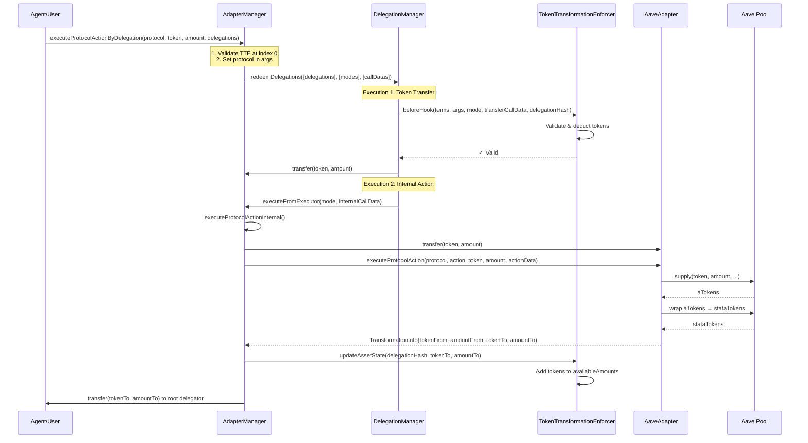

# Token Transformation System

## Overview

The Token Transformation System enables delegations to track and control token transformations through DeFi protocol interactions. This system allows AI agents and other automated systems to use delegated tokens in lending protocols (like Aave) while maintaining granular control over the evolving token positions.

## Problem Statement

When tokens are used in DeFi protocols, they often transform into different tokens:

- **Lending Protocols**: Depositing USDC into Aave yields wrapped aUSDC (a non-rebasing token)
- **Token Evolution**: A single delegation may evolve to control multiple token types

**Example Scenario:**

1. User delegates 1000 USDC to an AI agent
2. Agent deposits 500 USDC → receives 500 wrapped aUSDC (Aave)
3. Final state: User has control over 300 USDC + 500 wrapped aUSDC

The system maintains permission over **all tokens derived from the original delegation** until the delegation expires or is revoked.

## Architecture

The solution consists of three main components:

### 1. TokenTransformationEnforcer

A caveat enforcer that tracks multiple tokens per delegation hash.

**State:**

```solidity
mapping(bytes32 delegationHash => mapping(address token => uint256 amount)) public availableAmounts;
mapping(bytes32 delegationHash => bool initialized) public isInitialized;
address public immutable adapterManager;
```

**Key Functions:**

- `beforeHook()`: Validates token transfers and deducts from available amounts
- `updateAssetState()`: Adds new tokens after protocol interactions (only callable by AdapterManager)
- `getAvailableAmount()`: Public view function to query available amounts

**Terms Format:**

- Base (52 bytes): 20 bytes token address + 32 bytes initial amount
- Extended (optional): 1 byte protocol count + N \* 20 bytes protocol addresses
- Minimum: 52 bytes (no protocols)
- Maximum: 52 + 1 + (255 \* 20) = 5162 bytes

**Initialization:**

- On first use of the initial token, amount is initialized from terms
- Subsequent uses deduct from available amount
- Protocol addresses in `_args` are validated against `allowedProtocols` from terms

**Design Pattern: State Tracking**

The enforcer uses a state tracking pattern to maintain multiple tokens per delegation:

- Tracks what tokens are **available**, not what tokens exist
- Allows tracking multiple token types simultaneously
- Initializes lazily on first use to save gas
- Prevents double initialization with `isInitialized` mapping

### 2. AdapterManager

Central coordinator that routes protocol interactions to adapters and updates enforcer state.

**State:**

```solidity
IDelegationManager public immutable delegationManager;
TokenTransformationEnforcer public tokenTransformationEnforcer; // Settable by owner
mapping(address protocol => address adapter) public protocolAdapters;
```

**Key Functions:**

- `executeProtocolActionByDelegation()`: Main entry point for protocol interactions
- `registerProtocolAdapter()`: Register adapters for protocols (owner only)
- `setTokenTransformationEnforcer()`: Set the enforcer address (owner only)

**Flow:**

1. User calls `executeProtocolActionByDelegation()` with delegations
2. AdapterManager validates TokenTransformationEnforcer is at index 0 of root delegation
3. Sets protocol address in enforcer caveat args
4. Creates two executions via delegation redemption:
   - Execution 1: Transfer tokens from delegator to AdapterManager
   - Execution 2: Internal call to `executeProtocolActionInternal()`
5. Routes to adapter based on protocol address
6. Adapter executes protocol interaction and returns transformation info
7. AdapterManager updates enforcer state (adds output tokens)
8. Transfers output tokens to root delegator

**Design Pattern: Two-Phase Execution**

The system uses a two-phase execution pattern:

**Phase 1 - Token Transfer**: Validated through delegation redemption

- TokenTransformationEnforcer validates availability in `beforeHook()`
- Tokens are transferred from delegator to AdapterManager
- Amount is deducted from availableAmounts

**Phase 2 - Protocol Action**: Executed internally

- AdapterManager calls adapter to execute protocol interaction
- Adapter returns transformation information
- AdapterManager updates enforcer state with new tokens

**Why:** Separating validation from execution allows us to use the delegation framework's validation while maintaining control over protocol interactions.

**Security:**

- Only DelegationManager can call `executeFromExecutor()`
- Only AdapterManager can update enforcer state
- TokenTransformationEnforcer must be first caveat in root delegation

### 3. Protocol Adapters

Protocol-specific adapters that handle interactions with lending protocols.

**Current Adapters:**

- **AaveAdapter**: Handles Aave V3 deposits/withdrawals

**Adapter Interface:**

```solidity
interface IAdapter {
    struct TransformationInfo {
        address tokenFrom;
        uint256 amountFrom;
        address tokenTo;
        uint256 amountTo;
    }

    function executeProtocolAction(
        address _protocolAddress,
        string calldata _action,
        IERC20 _tokenFrom,
        uint256 _amountFrom,
        bytes calldata _actionData
    ) external returns (TransformationInfo memory);
}
```

**AaveAdapter Details:**

- Supports "deposit" and "withdraw" actions
- Wraps rebasing aTokens into non-rebasing stataTokens (ERC-4626)
- Dynamically detects if wrapper accepts aTokens or underlying tokens directly
- Returns transformation info: tokenFrom → tokenTo with amounts

**Design Pattern: Adapter Pattern**

Different DeFi protocols have different interfaces and behaviors. The adapter pattern:

- Encapsulates protocol-specific logic
- Provides a consistent interface for the AdapterManager
- Makes it easy to add support for new protocols

Each protocol has an adapter contract implementing `IAdapter` that handles protocol-specific details (approvals, wrapping, etc.) and returns standardized `TransformationInfo` structs.

## Contract Interaction Diagram



## How It Works

### Example Flow: Aave Deposit

1. **Initial Delegation**:

   ```
   User delegates 1000 USDC with TokenTransformationEnforcer
   Terms: [USDC address (20 bytes), 1000 (32 bytes), protocol count (1 byte), Aave Pool address (20 bytes)]
   ```

2. **Agent Initiates Deposit**:

   ```
   Agent calls AdapterManager.executeProtocolActionByDelegation(
       protocol: Aave Pool,
       tokenFrom: USDC,
       amountFrom: 500,
       delegations: [...]
   )
   ```

3. **Delegation Redemption**:

   - AdapterManager validates TokenTransformationEnforcer is at index 0
   - Sets protocol address in enforcer caveat args
   - DelegationManager validates delegations
   - TokenTransformationEnforcer.beforeHook() validates 500 USDC is available
   - Deducts 500 USDC from availableAmounts[delegationHash][USDC]
   - Transfers 500 USDC to AdapterManager

4. **Protocol Interaction**:

   - AdapterManager transfers tokens to AaveAdapter
   - AaveAdapter calls Aave Pool.supply(USDC, 500, ...)
   - AaveAdapter wraps aUSDC → wrapped aUSDC (stataToken)
   - Returns: tokenFrom=USDC, amountFrom=500, tokenTo=wrapped aUSDC, amountTo=500

5. **State Update**:

   - AdapterManager calls TokenTransformationEnforcer.updateAssetState(
     delegationHash,
     wrapped aUSDC,
     500
     )
   - Enforcer state: availableAmounts[delegationHash][wrapped aUSDC] = 500

6. **Token Transfer**:

   - AdapterManager transfers wrapped aUSDC to root delegator
   - Final state:
     - availableAmounts[delegationHash][USDC] = 500
     - availableAmounts[delegationHash][wrapped aUSDC] = 500

### Example Flow: Multiple Transformations

**Initial**: 1000 USDC delegated

**Step 1**: Deposit 500 USDC → Aave

- Result: 500 USDC + 500 wrapped aUSDC tracked

**Step 2**: Deposit 200 USDC → Aave

- Result: 300 USDC + 700 wrapped aUSDC tracked

**Step 3**: Withdraw 100 wrapped aUSDC → USDC

- Result: 400 USDC + 600 wrapped aUSDC tracked

All tokens remain under delegation control until expiration or revocation.

## Key Design Decisions

### 1. Wrapped Tokens for Rebasing Assets

**Problem:** Rebasing tokens (like aTokens) change balance over time, making tracking difficult.

**Solution:** Wrap rebasing tokens into non-rebasing tokens using ERC-4626 vaults.

**Implementation:** AaveAdapter wraps aTokens into stataTokens (StaticAToken), which have fixed supply and are easier to track.

### 2. AdapterManager as State Updater

**Problem:** Who can update the enforcer state after protocol interactions?

**Solution:** Only AdapterManager can call `updateAssetState()`.

**Rationale:**

- Ensures state updates only happen after verified protocol interactions
- Prevents unauthorized state manipulation
- Clear security boundary

**Implementation:** TokenTransformationEnforcer validates `msg.sender == adapterManager` in `updateAssetState()`.

### 3. Tokens Always Go to Root Delegator

**Problem:** Where should tokens be stored after protocol interactions?

**Solution:** All tokens are transferred to the root delegator.

**Rationale:**

- Clear ownership model
- Tokens never stay in contracts
- Simplifies accounting

**Flow:** Root Delegator → AdapterManager → Protocol → AdapterManager → Root Delegator

### 4. Terms Format Design

**Problem:** How to encode initial token, amount, and optional protocol restrictions?

**Solution:** Variable-length encoding with backward compatibility.

**Format:**

- Base (52 bytes): token address (20 bytes) + amount (32 bytes)
- Extended (optional): protocol count (1 byte) + protocol addresses (20 bytes each)

**Benefits:**

- Backward compatible (52 bytes minimum)
- Flexible (up to 255 protocols)
- Efficient encoding

### 5. Initialization on First Use

**Problem:** When should initial token amounts be set from terms?

**Solution:** Initialize on first use of the initial token.

**Rationale:**

- Lazy initialization saves gas
- Only initializes when actually needed
- Prevents double initialization

**Implementation:** Check `isInitialized[delegationHash]` and `token == initialToken` before initializing.

### 6. Protocol Validation Pattern

**Why:** Users may want to restrict which protocols can be used with their delegations.

**How it works:**

- Terms can include an optional list of allowed protocol addresses
- Protocol address is passed in `_args` when used with AdapterManager
- TokenTransformationEnforcer validates protocol against allowed list
- If no protocols specified, all protocols are allowed (backward compatible)

**Example:** Terms encode `[token, amount, protocolCount, protocol1, protocol2, ...]`

## Public API

### Query Available Amounts

```solidity
uint256 available = tokenTransformationEnforcer.getAvailableAmount(
    delegationHash,
    tokenAddress
);
```

### Check Protocol Adapters

```solidity
address adapter = adapterManager.protocolAdapters(protocolAddress);
```

## Security Considerations

1. **State Updates**: Only AdapterManager can update enforcer state
2. **Token Validation**: Enforcer validates all token transfers before execution
3. **Protocol Validation**: Protocol addresses are validated against allowed list in terms
4. **Ownership**: All tokens always belong to root delegator
5. **Initialization Protection**: Initial amount only set once per delegationHash
6. **Enforcer Position**: TokenTransformationEnforcer must be first caveat in root delegation

## Extensibility

### Adding New Protocols

To add support for a new protocol:

1. Create adapter contract implementing `IAdapter`
2. Implement `executeProtocolAction()` returning `TransformationInfo`
3. Register adapter in AdapterManager via `registerProtocolAdapter()`

### Adding New Actions

To add new actions to an existing adapter:

1. Add action string constant (e.g., `ACTION_BORROW`)
2. Add handler function (e.g., `_handleBorrow()`)
3. Route action in `executeProtocolAction()`

## Usage Example

```solidity
// 1. Create delegation with initial token
Delegation memory delegation = Delegation({
    delegator: user,
    delegate: agent,
    caveats: [Caveat({
        enforcer: address(tokenTransformationEnforcer),
        terms: abi.encodePacked(token, amount, protocolCount, protocolAddress),
        args: hex""
    })]
});

// 2. Agent calls AdapterManager
adapterManager.executeProtocolActionByDelegation(
    protocolAddress,
    token,
    amount,
    actionData,
    [delegation]
);

// 3. System handles:
//    - Validation through delegation redemption
//    - Protocol interaction via adapter
//    - State update in enforcer
//    - Token transfer to root delegator
```
