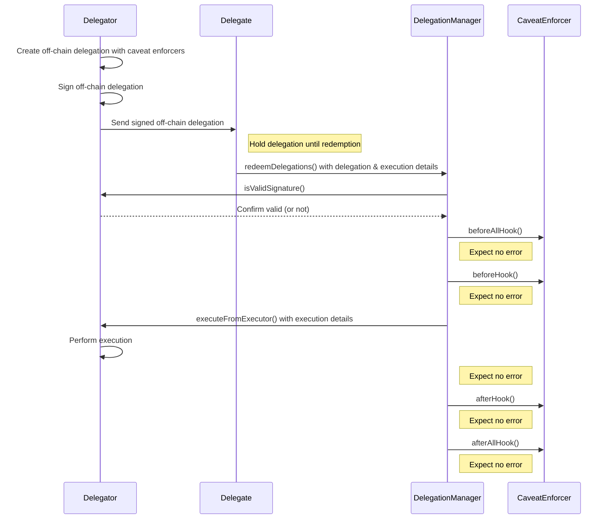

# Delegation redemption flow

This diagram illustrates how an off-chain delegation is created and subsequently redeemed on the Delegation Manager. The Delegation Manager is in charge of validating the signature of the delegation, validating the caveat enforcers, and if everything is correct it allows a Delegate to execute an action on behalf of the Delegator.

