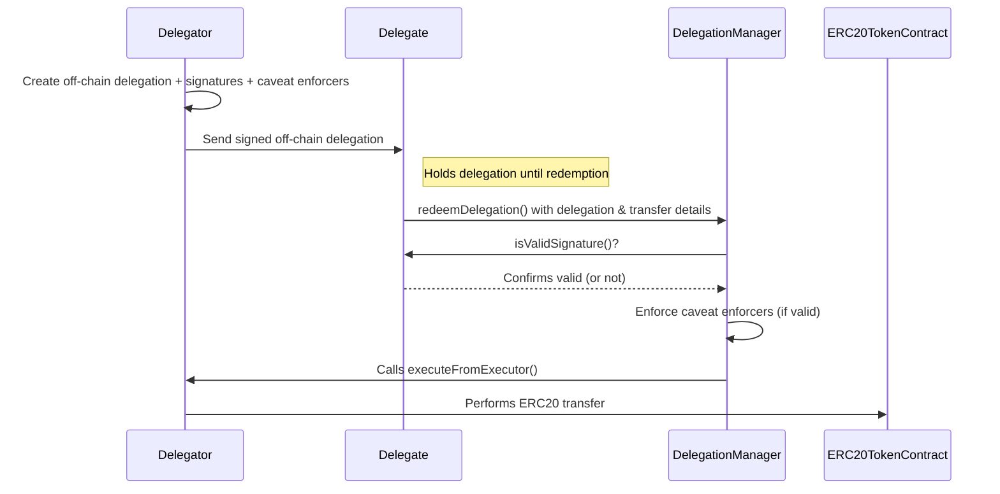

# Delegation Flow

This diagram illustrates how an off-chain delegation is created and subsequently redeemed, allowing a Delegate to transfer an ERC20 token on behalf of a Delegator.

```mermaid
sequenceDiagram
    participant Delegator
    participant Delegate
    participant DelegationManager
    participant ERC20TokenContract

    Delegator->>Delegator: Create off-chain delegation + signatures + caveat enforcers
    Delegator->>Delegate: Send signed off-chain delegation
    Note right of Delegate: Holds delegation until redemption

    Delegate->>DelegationManager: redeemDelegation() with delegation & transfer details
    DelegationManager->>Delegate: isValidSignature()?
    Delegate-->>DelegationManager: Confirms valid (or not)
    DelegationManager->>DelegationManager: Enforce caveat enforcers (if valid)
    DelegationManager->>Delegator: Calls executeFromExecutor()
    Delegator->>ERC20TokenContract: Performs ERC20 transfer
```
