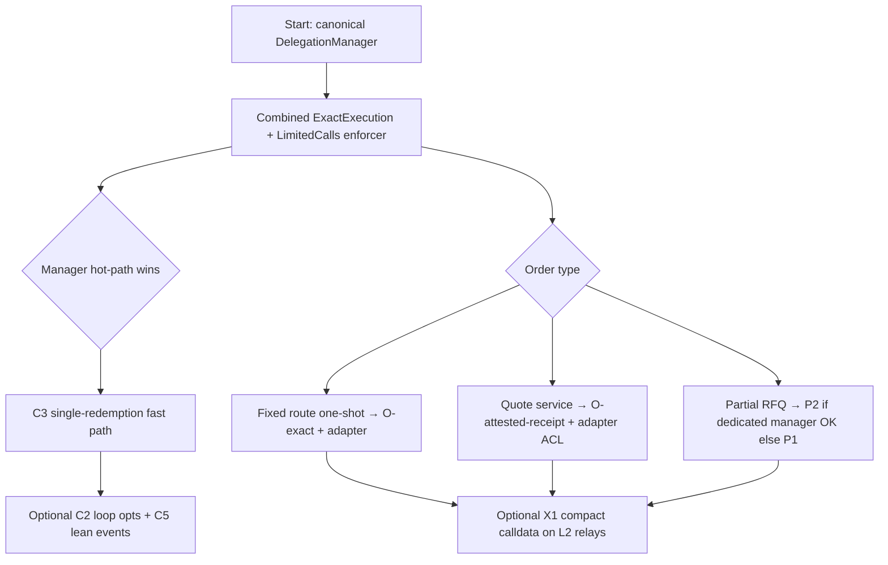

# Final ranked comparison — delegation manager gas experiments

**Branch:** `feat/limit-order-manager-gas-experiments`  
**Validation commit base:** `f984c6e`  
**Phase 6–7 run:** 2026-08-19  
**Environment:** Foundry 1.5.1, Solc 0.8.23, `evm_version = london`, `optimizer = true`

## Phase 6 validation summary

| Suite | Command | Result |
| --- | --- | --- |
| Experiment harness (default CI) | `forge test --isolate --match-path "test/experiments/**" -vv` | **29 passed**, 0 failed |
| Review regression | `forge test --isolate --match-path "test/review/**" -vv` | **10 passed**, 0 failed |
| Formatting | `forge fmt --check src/experiments test/experiments` | **Pass** (auto-fixed in Phase 6) |
| Build / sizes | `forge build --sizes` | **Pass** |

**Note on skipped tracks:** `foundry.toml` intentionally skips O\*, P\*, and X\* sources/tests from the default compile graph (solc 0.8.23 / London). Those tracks were benchmarked and security-tested in Phase 3–5 commits; numbers below come from documented `--isolate` runs in variant sheets. Re-enable by trimming `skip` or adding a Cancun profile once solc ≥ 0.8.24 is available project-wide.

### Slither triage (`src/experiments/`)

Slither 0.10.3 on the default Foundry graph: **no medium+ findings in compiled experiment contracts** (C1–C5, ProfileEnforcer, PersistentERC20HookCoordinator). Skipped O/P/X/LimitOrder sources were not in the compile set. Inherited patterns from `ExperimentDelegationManagerBase` match canonical manager (ignored decode returns, standard hook ordering). Manual review highlights:

| Risk | Variants | Severity |
| --- | --- | --- |
| ERC-1271 policy drift after first fill | X3 | **Disqualifying** |
| Settlement not guaranteed (quote + router only) | O-attested-trust | **High** — use receipt variant |
| Unpermissioned router registry | O-adapter (experiment) | **High** — gate before prod |
| Compromised quote signer | O-attested-* | **Medium** — bounded by MakerBounds + nonce replay map |
| Fee-on-transfer / rebasing / native ETH | P1, P2, O-* | **Medium** — explicitly rejected in v1 |

---

## Gas winners by track

Representative hot path unless noted. **Manager savings** = delta in `DelegationManager.redeemDelegations` execution gas. **Enforcer/adapter** = external caveat stack or settlement contract. **Calldata** = permission context + caveat args (L1/L2 posting sensitive).

### C\* — compatible manager ablations (1-exec batch, combined enforcer)

Baseline C0: **154,450 exec / 185,722 est. tx**

| Rank | ID | Exec gas | Est. tx | Δ exec vs C0 | Verdict |
| ---: | --- | ---: | ---: | ---: | --- |
| 1 | **C5** lean events | 145,325 | 176,609 | **−5.9%** | Optional keep (observable) |
| 2 | **C3** single-redemption fast path | 150,767 | 182,051 | **−2.4%** | **Keep** |
| 3 | C2 cached lengths + unchecked | 152,601 | 183,873 | −1.2% | Drop alone; compose |
| 4 | C1 domain hoist | 153,247 | 184,519 | −0.8% | Drop alone |
| 5 | C4 fused validation | 154,381 | 185,665 | ~0% | Drop |

**Enforcer ablation (not manager):** Profile enforcer (+mode/validity) costs **+20,280 est. tx** vs combined baseline enforcer — expected trade for signed order profiles.

**Composed recommendation:** **C3 + C2** (+ optional C1) for behavior-preserving manager path; **C5** only when indexers accept lean events.

### O\* — one-shot / service-attested (single adapter swap, EIP-7702 EOA)

| Rank | ID | Exec gas | Est. tx | vs O-exact | Verdict |
| ---: | --- | ---: | ---: | ---: | --- |
| 1 | **O-exact** | 231,426 | 267,734 | — | **Keep** (safest control) |
| 2 | O-attested-trust | 248,174 | 288,590 | +7.8% tx | Drop as default |
| 3 | O-attested-receipt | 257,068 | 297,484 | +11.1% tx | **Keep** when quote service required |

**Savings decomposition:** O-exact is **enforcer + adapter dominated** (~80k above C0 manager-only baseline); manager remains canonical. Attested overhead is **+ECDSA + calldata**, not manager mutation.

### P\* — partial-fill RFQ (first partial fill, 100 sell units)

| Rank | ID | Exec gas | Est. tx | vs P1 | Verdict |
| ---: | --- | ---: | ---: | ---: | --- |
| 1 | **P2** integrated manager | 184,599 | 212,471 | **−31% exec** | **Keep** if dedicated manager OK |
| 2 | P1 enforcer + adapter | 266,815 | 298,023 | — | Keep for composability |

P2 subsequent fills: **128,799 exec / 156,671 tx** (~50% below P1) — largest sustained win in Phase 4.

### X\* — exploratory (1-exec combined enforcer unless noted)

| Rank | ID | Exec gas | Est. tx | Δ vs control | Verdict |
| ---: | --- | ---: | ---: | ---: | --- |
| 1 | X3 warm cache (2nd fill) | 114,886 | 146,146 | **−21.3% tx** | **Reject** (ERC-1271) |
| 2 | **X1** compact encoding | 138,389 | 167,937 | **−9.6% tx** | Drop general; optional L2 transport |
| 3 | X2 persistent coordinator | 140,449 | 170,577 | control | Skip transient until Cancun CI |
| — | X3 first fill | 178,216 | 209,476 | +12.7% tx | Reject (cold penalty) |

**Calldata leader:** X1 saves **−416 bytes (−25%)** on permission context — often beats exec savings on L2.

---

## Global top 5 gas winners (est. tx, production-eligible only)

| Rank | Variant | Est. tx | Savings vs track control | Eligible? |
| ---: | --- | ---: | ---: | --- |
| 1 | **C5** lean events | 176,609 | −4.9% vs C0 | Yes (observable trade-off) |
| 2 | **C3** single fast path | 182,051 | −2.0% vs C0 | **Yes** |
| 3 | **P2** partial fill (1st) | 212,471 | −31% vs P1 | Yes (dedicated manager) |
| 4 | **X1** compact context | 167,937 | −9.6% vs standard ABI | Optional (fixed schema) |
| 5 | Combined vs separate enforcers | 187,835 vs 212,424 | −11.6% vs separate | **Yes** (enforcer layout) |

*Excluded from eligibility: X3 warm cache (−21% but ERC-1271 regression), SimpleDelegationManager (−18% but unsafe), O-attested-trust (settlement gap).*

---

## Security verdicts (all variants)

| ID | Verdict | Rationale |
| --- | --- | --- |
| C0 | Keep (control) | Canonical behavior reference |
| C1 | Drop | Sub-threshold gas; no semantic gain |
| C2 | Compose | Safe; pair with C3 |
| C3 | **Keep** | Differential + forwarding spy clean |
| C4 | Drop | No gas win; extra review surface |
| C5 | Optional | Lean events; indexer breaking |
| ProfileEnforcer | **Keep** | Required mode/validity binding for orders |
| O-exact | **Keep** | Deterministic calldata; no new trust |
| O-attested-trust | **Drop** default | No on-chain settlement proof |
| O-attested-receipt | **Keep** | Closes trust gap (+29k tx vs O-exact) |
| O-adapter | Keep w/ ACL | Shared primitive; fix router governance |
| P1 | Keep | Canonical composition reference |
| P2 | **Keep** | Best RFQ gas; same economics as P1 |
| X1 | Drop general | Fixed schema; ERC-7710 incompatibility |
| X2 transient | Skip | Needs Cancun + solc 0.8.24 |
| X3 | **Reject** | Signature cache vs ERC-1271 policy changes |

---

## Recommended production path



### Layered rollout

1. **Enforcer first (no manager fork):** Ship combined enforcer (+ ProfileEnforcer when mode/validity must bind). Saves **~24k tx** vs separate enforcers with zero manager risk.
2. **Manager micro-wins:** Merge **C3** (+ **C2** composition) into production manager after differential CI gate. Target **~2–3%** exec on single-redemption limit orders.
3. **One-shot limit orders:** Default **O-exact** for fully signed routes. If solvers need flexible routing, use **O-attested-receipt** (never trust-only) with monitored quote signer and bounded TTL.
4. **Partial RFQ:** Prefer **P2** when makers accept a dedicated `LimitOrderDelegationManager` domain; fall back to **P1** when composability with arbitrary enforcer stacks matters more than ~30–50% fill gas.
5. **Calldata / L2:** Evaluate **X1** compact encoding for relayer-controlled fixed-schema orders; defer **X2/X3** until Cancun CI and unless explicit maker opt-in with epoch policy.

### Effect separation cheat sheet

| Effect | Where measured | Typical magnitude (1-exec swap) |
| --- | --- | ---: |
| Manager (C3) | `CompatibleAblationGasBenchmark` | −3.7k exec |
| Enforcer layout | `GasOptimizationAblation` combined vs separate | −24.6k tx |
| Attested quote + receipt | `OneShotGasBenchmark` | +20–30k tx vs O-exact |
| Integrated RFQ manager | P2 vs P1 | −85k tx (first fill) |
| Compact calldata (X1) | bytes on wire | −416 bytes (−25%) |

---

## Contract sizes (compiled experiment artifacts)

| Contract | Runtime (B) | Initcode (B) |
| --- | ---: | ---: |
| DelegationManagerC3 | 14,589 | 16,221 |
| DelegationManagerC1 | 11,039 | 12,671 |
| DelegationManagerC5 | 11,262 | 12,894 |
| ExactExecutionBatchLimitedCallsProfileEnforcer | 3,276 | 3,308 |
| PersistentERC20HookCoordinator | 2,244 | 2,276 |

C3 runtime is larger due to dual-path (single + matrix) logic; still within deployment budget.

---

## Reproduce

```bash
# Phase 6 default CI path (C* + harness)
forge test --isolate --match-path "test/experiments/**" -vv
forge test --isolate --match-path "test/review/**" -vv
forge build --sizes
forge fmt --check src/experiments test/experiments

# Skipped tracks (manual — trim foundry.toml skip first)
forge test --isolate -vv --match-contract OneShotGasBenchmark
forge test --isolate -vv --match-contract PartialFillRfq
forge test --isolate -vv --match-contract X1CompactOrderBenchmark
forge test --isolate -vv --match-contract X3ActivationCacheBenchmark
```

Per-variant detail: `C1.md` … `X3.md`, `O.md`, `P1-partial-fill-rfq-enforcer.md`, `P2-limit-order-delegation-manager.md`.
